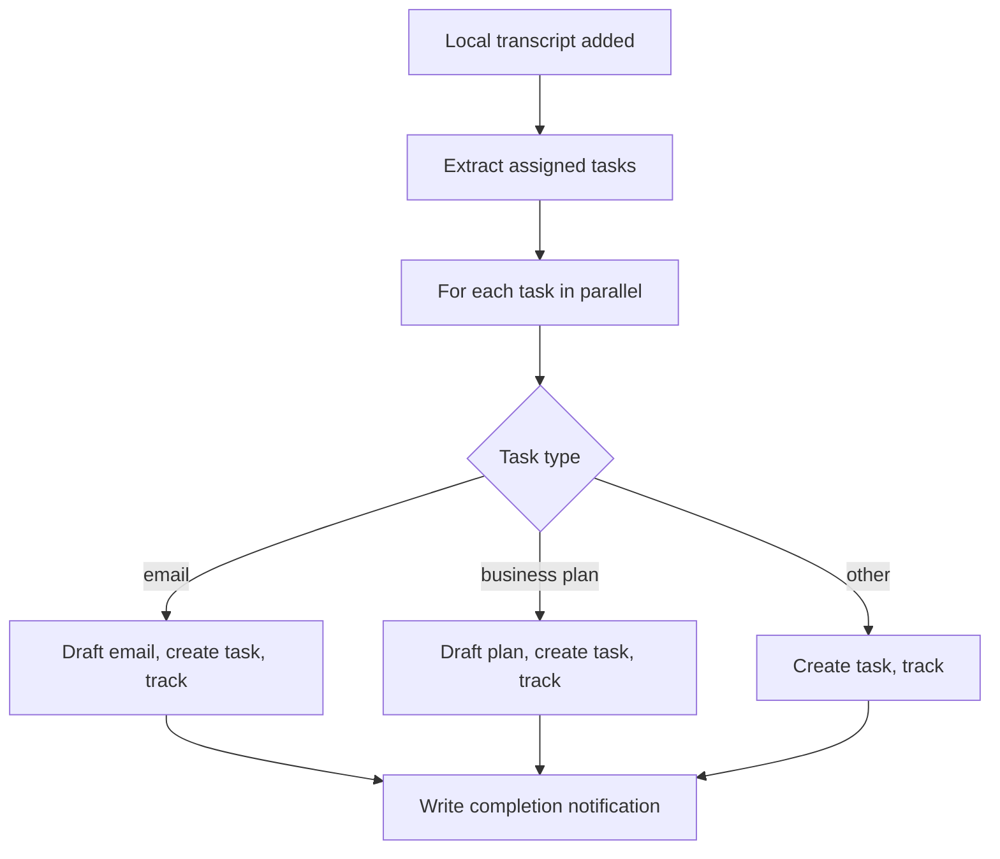
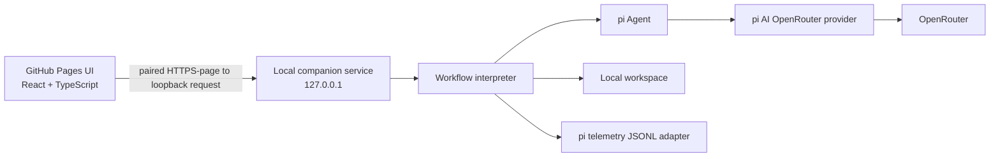

# Chief of Staff Local Workflow — Implementation Specification

Status: implementation-ready  
Specification version: 1.0  
Date: 2026-08-15  
Source workflow: `C:\Users\nicolas\Documents\GitHub\transcript-found42\raw\original_relay_workflow.json`

The key words **MUST**, **MUST NOT**, **SHOULD**, and **MAY** are normative.

## 1. Purpose

Build a local-first implementation of the **“Chief of Staff Agent: Take Actions from Transcripts”** workflow. The implementation MUST preserve the source workflow’s observable behavior:

1. Detect a newly added transcript.
2. Extract only the tasks assigned to the configured user.
3. Classify each task as `email`, `business plan`, or `other`.
4. Process tasks through the same three branches.
5. Create the equivalent drafts, planning documents, tasks, tracking rows, and completion notification.
6. Preserve the original prompts, references, branch rules, and output ordering.

Every former external connection MUST be replaced by local files and folders. The only network calls made during a live run MUST be LLM calls sent through OpenRouter.

The application consists of:

- a TypeScript browser UI published to GitHub Pages;
- a TypeScript local companion service that owns the filesystem, secrets, workflow interpreter, and pi agents;
- an immutable, vendor-neutral workflow definition.

## 2. Definition of “the exact same thing”

Parity means business-behavior parity, not a clone of the source platform’s editor or infrastructure.

The implementation MUST preserve:

- the 15 exported step identities and their order;
- the iterator’s `PARALLEL` behavior, subject to a configurable concurrency ceiling;
- the task extraction schema and its three task types;
- the two explicit branch rules and the fallback branch;
- the original prompt text, with only documented placeholder and resource resolution;
- the same task titles, draft/document templates, summary template, and downstream references;
- one tracking record per extracted task;
- “trigger once per newly added file” semantics;
- completion notification only after every task iteration has settled successfully.

The implementation does not need to preserve source-platform connection IDs, resource URLs, editor metadata, deprecated model namespaces, or the former visual workflow editor.

## 3. Scope

### 3.1 In scope

- Local transcript inbox and watcher.
- Manual transcript upload from the UI into that inbox.
- Workflow-definition parser, validator, reference resolver, template renderer, iterator, and path dispatcher for the step types used by this workflow.
- Local adapters for Drive, Gmail drafts, Google Tasks, Google Docs, Calendar, email notification, and source data tables.
- OpenRouter-backed pi agents.
- Run history, step status, logs, artifact previews, retry, and configuration UI.
- Offline deterministic tests and opt-in live OpenRouter smoke tests.
- GitHub Actions deployment of the static UI to GitHub Pages.

### 3.2 Out of scope

- Real Google APIs or any other SaaS connector.
- Sending an email; the workflow creates a local draft and a local completion notification only.
- A general-purpose compatibility engine. Only the step types present in revision 219 are required.
- Editing the workflow graph or prompts in the UI.
- Hosting the local companion service on GitHub Pages.
- Multi-user accounts, cloud sync, mobile browsers, or a native desktop wrapper.

## 4. Locked technical decisions

| Area | Decision |
|---|---|
| Language | TypeScript for UI, service, workflow engine, tests, and shared contracts. |
| Runtime | Node.js `>=22.19.0`, required by the selected pi packages. |
| UI | React + Vite + TypeScript, using a hash router so project Pages URLs need no rewrite support. |
| Local API | Fastify on `127.0.0.1`, REST plus authenticated NDJSON event streams. |
| Agent framework | `@earendil-works/pi-agent-core` `0.84.2`. |
| LLM abstraction | `@earendil-works/pi-ai` `0.84.2` with only `openrouterProvider()` registered. |
| Telemetry | `@earendil-works/pi-telemetry` `0.84.2`; in-memory in tests and a conforming JSONL adapter locally. |
| Package policy | Pin all three pi packages to the same exact version. Upgrade them together after tests pass. |
| Validation | TypeBox for agent tool inputs and shared runtime schemas. |
| Tests | Vitest for unit/integration tests; Playwright for UI end-to-end tests. |
| Time and IDs | Injected clock and ID generator; ULIDs in live mode and deterministic fakes in tests. |
| Writes | UTF-8, LF line endings, atomic temp-file + rename, and path containment checks. |

## 5. Source workflow

The finished project MUST keep a vendor-neutral definition at `reference/workflow-definition.json`. The original automation export is migration input only and MUST NOT be committed, copied into build artifacts, included in fixtures or snapshots, or referenced by project documentation. The committed definition MUST contain only the 15 required steps, prompt text, input templates, schemas, branch rules, and local step metadata described by this specification. It MUST omit former connection IDs, provider descriptions, model namespaces, and editor metadata, and it MUST set every AI step’s model input to `nvidia/nemotron-3.5-lightning`.

The retired platform’s brand name is prohibited throughout tracked source, documentation, tests, fixtures, filenames, dependency metadata, generated bundles, and packaged artifacts. CI MUST scan case-insensitively for it, using an out-of-band `BANNED_VENDOR_TOKEN`, and fail on any match. The scanner MUST also fail if that variable is missing or empty.

On service startup, definition validation MUST assert:

- `schemaVersion === 1`;
- source revision is `219`;
- thread IDs and step IDs match this specification;
- the SHA-256 matches `reference/workflow-definition.sha256`;
- every referenced step type has a registered adapter;
- every `$ref` and template reference is syntactically valid;
- the three known data-table validation errors are present.

An unrecognized workflow hash MUST fail closed with `WORKFLOW_DEFINITION_CHANGED`. The error MUST tell the developer to review the new export and update the spec, tests, and stored hash.

### 5.1 Workflow topology



### 5.2 Exported step map

| Step | Source step type | Required local behavior |
|---|---|---|
| `trigger` | `drive.fileAddedToFolder` | Claim one stable file from `inbox/transcripts/`; expose the required trigger fields. |
| `eitxht` | `ai.prompt.object` | Use a pi agent and OpenRouter to extract tasks matching the export’s `userSchema`. |
| `yk5itn` | `iterator` | Run one iteration per task using bounded parallelism; aggregate results in source order. |
| `ou028y` | `paths` | Route `email`, `business plan`, or fallback `other` using the exported rules. |
| `maoa1p` | `ai.prompt.text` | Draft the email with a pi agent; expose the local calendar tool. |
| `axgv0j` | `gmail.saveAsDraft` | Write a local Markdown email draft with metadata. |
| `x1gstq` | `googletasks.createTask` | Write an email-draft follow-up task JSON file. |
| `7b5596` | `builtin.addToDataTable` | Upsert the email branch’s row in the local tracking CSV. |
| `ia2vvr` | `ai.prompt.text` | Draft the business plan with a pi agent. |
| `kjlw70` | `docs.createDoc` | Write the planning document as Markdown. |
| `4a71s7` | `googletasks.createTask` | Write a business-plan follow-up task JSON file. |
| `1730yy` | `builtin.addToDataTable` | Upsert the business-plan branch’s tracking row. |
| `8w9czb` | `googletasks.createTask` | Write an ordinary task JSON file. |
| `pthrsh` | `builtin.addToDataTable` | Upsert the ordinary branch’s tracking row. |
| `aase0r` | `builtin.sendEmailNotification` | Write the exported completion summary as Markdown. |

## 6. Connection-to-filesystem mapping

| Former connection/resource | Local replacement | Read/write contract |
|---|---|---|
| Drive folder `Transcripts` | `inbox/transcripts/` | Watch for stable `.txt`, `.md`, `.pdf`, and `.docx` files. |
| Drive file object | Claimed source under `source/processing/<run-id>/` | Read-only after claim; SHA-256 recorded. |
| Gmail draft | `gmail/drafts/<artifact-id>.md` | One file per draft with YAML front matter and Markdown body. |
| Google Tasks list for email drafts | `tasks/email-drafts/<artifact-id>.json` | One validated task resource per file. |
| Google Tasks list for business plans | `tasks/business-plans/<artifact-id>.json` | One validated task resource per file. |
| Google Tasks default list | `tasks/my-tasks/<artifact-id>.json` | One validated task resource per file. |
| Drive folder `Strategy and planning` + Google Doc | `docs/strategy-and-planning/<artifact-id>.md` | One plan per Markdown file. |
| Google Calendar `Find Event` | `calendar/events.json` | Read-only event list queried by the email agent tool. |
| Email notification to self | `notifications/<run-id>-summary.md` | Completion summary; no delivery occurs. |
| Source data table | `tracking/actions.csv` | Atomic, idempotent upsert by `row_id`. |
| Source file/resource URLs | `local://<workspace-relative-path>` | Stored in step artifacts; UI resolves them through the local API. |
| AI model calls | `nvidia/nemotron-3.5-lightning` through OpenRouter | The sole live network integration. |

No adapter may silently call a remote service. A test MUST fail if a non-OpenRouter outbound request is attempted.

## 7. System architecture

GitHub Pages is static hosting, so it can publish the HTML/CSS/JavaScript UI but cannot watch folders, execute Node.js, keep secrets, or write local artifacts. Those responsibilities belong to the loopback-only companion service.



### 7.1 Deployment modes

| Mode | UI origin | Service | Purpose |
|---|---|---|---|
| Local development | Vite `http://localhost:5173` | `http://127.0.0.1:4317` | Fast development with Vite proxy and HMR. |
| Pages development preview | `https://<owner>.github.io/<repo>/` | loopback service | Required hosted development surface. Browser may request loopback-network permission. |
| Offline fallback | service-served copy of the same built UI | same loopback origin | Browser fallback when cross-origin loopback access is unsupported or denied. |

The Pages build MUST remain fully static. It MUST NOT contain an API key, transcript, generated artifact, run log, profile, or local absolute path.

## 8. Repository layout

```text
chief-of-staff-local/
├── SPEC.md
├── package.json
├── package-lock.json
├── tsconfig.base.json
├── reference/
│   ├── workflow-definition.json
│   └── workflow-definition.sha256
├── apps/
│   ├── service/
│   │   └── src/
│   │       ├── api/
│   │       ├── agents/
│   │       ├── adapters/
│   │       ├── filesystem/
│   │       ├── telemetry/
│   │       ├── watcher/
│   │       └── main.ts
│   └── web/
│       ├── src/
│       └── vite.config.ts
├── packages/
│   ├── contracts/
│   └── workflow/
│       └── src/
│           ├── interpreter.ts
│           ├── resolver.ts
│           ├── templates.ts
│           └── definition.ts
├── fixtures/
│   ├── transcripts/
│   ├── calendar/
│   └── llm/
├── tests/
└── .github/workflows/
    ├── ci.yml
    └── pages.yml
```

The repository MUST NOT contain a real workspace, API key, live transcript, or run output.

## 9. Local workspace layout

The service accepts an absolute workspace root via `--workspace`; the default is `./local-workspace` relative to the service launch directory.

```text
local-workspace/
├── config/
│   ├── app.json
│   ├── profile.json
│   └── models.json
├── inbox/transcripts/
├── source/
│   ├── processing/<run-id>/
│   ├── processed/<run-id>/
│   └── failed/<run-id>/
├── calendar/events.json
├── gmail/drafts/
├── tasks/
│   ├── email-drafts/
│   ├── business-plans/
│   └── my-tasks/
├── docs/strategy-and-planning/
├── notifications/
├── tracking/actions.csv
├── runs/<run-id>/
│   ├── manifest.json
│   ├── events.jsonl
│   ├── telemetry.jsonl
│   ├── input/
│   │   ├── transcript.txt
│   │   └── source-metadata.json
│   ├── steps/
│   │   ├── trigger.json
│   │   ├── eitxht.json
│   │   ├── yk5itn.json
│   │   ├── aase0r.json
│   │   └── <loop-step-id>/<zero-padded-task-index>.json
│   └── llm/
│       └── <invocation-id>.request.json
└── service/
    ├── claims/
    └── pairing.json
```

The transcript copy in `runs/<run-id>/input/transcript.txt` is normalized plain text used by the agents. The original bytes remain in `source/processed/` or `source/failed/`.

## 10. Configuration contracts

### 10.1 `config/profile.json`

```json
{
  "name": "Required full name",
  "title": "Required title",
  "company": "Required company",
  "writingStyle": "Required description of writing style",
  "focusAreas": ["At least one focus area"]
}
```

The service MUST reject a run if any `[YOUR ...]`, `[DESCRIBE ...]`, or `[LIST ...]` placeholder would remain after substitution.

### 10.2 `config/models.json`

```json
{
  "provider": "openrouter",
  "model": "nvidia/nemotron-3.5-lightning",
  "reasoningEffort": null,
  "maxOutputTokens": null
}
```

`nvidia/nemotron-3.5-lightning` MUST be used for `eitxht`, `maoa1p`, and `ia2vvr`. Per-step model overrides are prohibited in version 1. The model value remains configuration rather than a code constant so availability can be validated at startup and changed only through a future specification revision.

### 10.3 `config/app.json`

```json
{
  "maxParallelTasks": 4,
  "watchDebounceMs": 750,
  "maxTranscriptBytes": 26214400,
  "allowedUiOrigins": [
    "http://localhost:5173",
    "https://OWNER.github.io"
  ]
}
```

The service MUST validate the exact Pages origin. It MUST NOT accept wildcard CORS origins.

### 10.4 `calendar/events.json`

```json
{
  "timezone": "America/New_York",
  "events": [
    {
      "id": "event-1",
      "start": "2026-08-17T10:00:00-04:00",
      "end": "2026-08-17T10:30:00-04:00",
      "summary": "Busy",
      "status": "busy"
    }
  ]
}
```

Allowed `status` values are `busy`, `tentative`, and `free`. The calendar tool MUST return existing conflicts and candidate free windows; it MUST never create or modify events.

## 11. Shared data contracts

### 11.1 Extracted task

The runtime schema MUST be derived from the export’s `eitxht.userSchema`. The TypeScript representation is:

```ts
type ExtractedTask = {
  "Task name": string;
  "Task type": "email" | "business plan" | "other";
  "Assigned to": string;
  "Deadline"?: string;
  "Email details"?: {
    "Recipient": string;
    "Subject": string;
    "Body": string;
  };
  "Business plan details"?: {
    "Title": string;
    "Summary": string;
  };
  "Task description"?: string;
};
```

Additional branch invariants:

- `email` MUST include complete `Email details`.
- `business plan` MUST include complete `Business plan details`.
- `other` MUST include `Task description`.
- `Deadline`, when non-empty, MUST parse as an ISO 8601 date-time.
- `Task name` MUST be non-empty and no longer than 50 Unicode code points.
- `Assigned to` MUST match the configured name after trim and case folding; nonmatching tasks are discarded and reported in telemetry as a count only.

### 11.2 Local task resource

```json
{
  "schemaVersion": 1,
  "id": "<artifact-id>",
  "list": "email-drafts | business-plans | my-tasks",
  "title": "string",
  "due": "ISO 8601 or null",
  "notes": "string",
  "status": "needsAction",
  "source": {
    "runId": "string",
    "taskIndex": 0,
    "stepId": "x1gstq | 4a71s7 | 8w9czb"
  },
  "createdAt": "ISO 8601"
}
```

### 11.3 Email draft Markdown

```md
---
schemaVersion: 1
id: <artifact-id>
to:
  - person@example.com
labels:
  - Inbox
subject: Subject from extracted task
runId: <run-id>
taskIndex: 0
createdAt: <ISO 8601>
---

<body returned by step maoa1p>
```

The `Draft URL` output is `local://gmail/drafts/<artifact-id>.md`.

### 11.4 Planning document Markdown

The title, high-level summary, and V1 body MUST match the exported `kjlw70` template. The `Document URL` output is `local://docs/strategy-and-planning/<artifact-id>.md`.

### 11.5 Tracking CSV

`tracking/actions.csv` MUST have this exact header:

```csv
row_id,run_id,task_index,task_name,task_type,assigned_to,deadline,source_step,target_uri,status,created_at,source_validation_error
```

Each `builtin.addToDataTable` invocation performs an atomic upsert by deterministic `row_id`. `source_validation_error` MUST be `Scope is not set`, preserving the export defect while supplying the missing local table scope. The warning `LOCAL_SCOPE_SUPPLIED` MUST also appear in the run manifest.

### 11.6 Step artifact envelope

```ts
type StepArtifact<T> = {
  schemaVersion: 1;
  runId: string;
  stepId: string;
  invocationId: string;
  taskIndex: number | null;
  status: "succeeded" | "failed" | "skipped";
  startedAt: string;
  finishedAt: string;
  output: T | null;
  warnings: Array<{ code: string; message: string }>;
  error: { code: string; message: string; retryable: boolean } | null;
};
```

Non-loop steps use `steps/<stepId>.json`. A step invoked inside the iterator MUST use `steps/<stepId>/<task-index padded to 4 digits>.json`; it MUST NOT overwrite a different task’s artifact.

### 11.7 Run manifest

The manifest MUST include:

- `schemaVersion`, `runId`, and current run status;
- workflow export path, revision, and SHA-256;
- original source filename, MIME type, byte size, timestamps, and SHA-256;
- normalized transcript SHA-256;
- profile and model-config SHA-256 values;
- injected `now` value and timezone;
- selected LLM mode and exact OpenRouter model per AI invocation;
- ordered task summary and branch selected for each task;
- every step invocation, duration, retry count, warnings, error, and artifact URI;
- token usage and estimated cost when OpenRouter/pi returns them;
- `unresolvedRefs`, which MUST be empty for a successful run;
- the three `LOCAL_SCOPE_SUPPLIED` warnings;
- final artifact URIs.

Secrets, prompts, completions, transcript text, and tool arguments MUST NOT appear in the manifest or telemetry.

## 12. Filesystem ingestion and lifecycle

1. Watch `inbox/transcripts/` using `chokidar` and also scan it on startup.
2. Ignore directories, hidden files, temporary suffixes, and unsupported extensions.
3. A file is stable after size and `mtime` are unchanged for `watchDebounceMs` and it can be opened for reading.
4. Enforce `maxTranscriptBytes` before parsing.
5. Generate the run ID and atomically move the source into `source/processing/<run-id>/` to claim it.
6. Parse `.txt` and `.md` as UTF-8, `.pdf` with `pdfjs-dist`, and `.docx` with `mammoth`.
7. Normalize to UTF-8 text with LF endings and write the run input snapshot.
8. Execute the workflow.
9. On success, atomically move the original into `source/processed/<run-id>/`.
10. On terminal failure, move it into `source/failed/<run-id>/` and write `failure.json`.

The move implements “once per newly added file” behavior. Copying the same contents into the inbox again is a new file event and MUST start a new run.

## 13. Interpreter semantics

### 13.1 Definition loading

Load and parse the canonical workflow definition once. Adapters receive immutable step definitions. Prompts, input templates, branch rules, output schemas, and step order MUST come from the definition, not duplicated constants.

### 13.2 Reference resolution

The resolver supports:

- object refs such as `{ "ref": "yk5itn_each.Deadline" }`;
- inline refs such as `{{maoa1p.message}}`;
- system refs such as `{{system.now}}`;
- `{{#each task in eitxht}}...{{/each}}` blocks used by the notification;
- the full current iterator object through the `yk5itn_each` namespace.

Resolution order is current iterator context, completed invocation artifacts, trigger artifact, then system context. Missing required values MUST fail with `UNRESOLVED_REFERENCE` containing the complete reference and consuming step ID. An explicitly optional missing property resolves to `null` or an empty template string as appropriate.

`{{system.now}}` MUST come from the run’s injected clock. Step code MUST NOT independently call the wall clock for business values.

### 13.3 Profile substitution

Before template resolution, replace the bracketed profile placeholders in AI prompts from `profile.json`. Preserve all other characters, spacing, and line breaks exactly. The application MUST NOT “improve” or rewrite the prompts.

### 13.4 Resource context

`trigger.File URL` resolves to a stable `local://` URI. Because an OpenRouter model cannot dereference local paths, every AI invocation whose prompt references the transcript MUST also receive the normalized transcript as a clearly delimited context message. This is context injection, not prompt rewriting.

### 13.5 Iterator and ordering

- Begin task iterations concurrently with `maxParallelTasks` as the ceiling.
- Within one task, execute branch steps sequentially in export order.
- Serialize shared CSV commits with a mutex.
- Use deterministic artifact IDs based on `runId`, `taskIndex`, and `stepId`.
- Store iterator aggregate output in original extraction order, never completion order.
- If any iteration fails, wait for already-started iterations to settle, mark the iterator failed, and do not run the completion notification.

### 13.6 Path dispatch

- `Task type === "email"` routes to `ou028y_xg63bi`.
- `Task type === "business plan"` routes to `ou028y_vd3vc1`.
- All other values route to `ou028y_wtnzhv`, matching the export’s fallback rule.

Schema validation should normally make the fallback value exactly `other`; the dispatcher still implements the exported fallback.

## 14. pi agent integration

### 14.1 Package initialization

The service MUST register only the OpenRouter provider:

```ts
import { Agent } from "@earendil-works/pi-agent-core";
import { createModels } from "@earendil-works/pi-ai";
import { openrouterProvider } from "@earendil-works/pi-ai/providers/openrouter";

const models = createModels();
models.setProvider(openrouterProvider());

const model = models.getModel("openrouter", configuredOpenRouterModelId);
if (!model) throw new Error("Configured OpenRouter model is not in the pi catalog");
```

At startup, the service MUST validate the configured model before accepting runs. The API key MUST resolve only from the service process environment variable `OPENROUTER_API_KEY` in live mode.

### 14.2 Agent lifecycle

- Create a fresh `Agent` for each AI step invocation; never share message state across tasks.
- Set `sessionId` to `<run-id>:<step-id>:<task-index-or-main>`.
- Use `models.streamSimple.bind(models)` as `streamFn`.
- Set `toolExecution: "sequential"` for deterministic tool behavior inside an invocation.
- Subscribe to agent events and translate them to redacted workflow progress events.
- Pass the run abort signal through all agent and tool operations.
- Abort the active agent when the user cancels the run.

### 14.3 Structured extraction agent (`eitxht`)

The extraction agent MUST receive:

- the profile-substituted export prompt;
- the normalized transcript context;
- exactly one tool named `submit_tasks` whose TypeBox parameter schema is `{ tasks: ExtractedTask[] }`.

The system prompt MUST require exactly one `submit_tasks` call and prohibit ordinary prose. The tool validates branch invariants, captures the tasks, returns a success result with `terminate: true`, and performs no filesystem writes. `beforeToolCall` MUST block any tool name other than `submit_tasks`.

If the agent finishes without one valid submission, submits twice, or submits invalid data, the step fails with `INVALID_STRUCTURED_OUTPUT`. This preserves the source object-output contract while using pi’s agent/tool loop.

### 14.4 Email drafting agent (`maoa1p`)

The email agent receives the original export prompt, transcript context, and one local tool:

```ts
find_calendar_events({
  earliest: string,
  latest: string,
  durationMinutes: number,
  timezone?: string
})
```

The tool reads only `calendar/events.json`, returns conflicts plus up to five free candidate windows, and never writes. The model may call it only when the email requires a meeting. The final assistant text becomes `maoa1p.message` without post-editing.

The verifier records warnings for an em dash or a probable sign-off because the original prompt forbids them, but it MUST NOT silently rewrite model output.

### 14.5 Business-plan agent (`ia2vvr`)

The plan agent receives the canonical prompt and transcript context with no filesystem tool. Its final assistant text becomes `ia2vvr.message`. A result above 1,000 words records `PLAN_WORD_LIMIT_EXCEEDED` but remains the step output, matching the source workflow’s prompt-driven behavior.

### 14.6 Source AI feature flags

The export’s `codeSandbox: AUTO`, `webAccess: AUTO`, empty knowledge sources, and empty remote MCP list do not represent configured connections. This implementation MUST expose no web, shell, code-execution, remote MCP, or arbitrary file tool to an agent. The local calendar tool is the only agent tool besides `submit_tasks`.

## 15. OpenRouter behavior

### 15.1 Live mode

Live runs MUST use OpenRouter through pi-ai. The service MUST send the configured model ID and MAY attach application attribution headers through pi’s header transform. The API key MUST never cross the local API or appear in logs.

Required startup checks:

- `OPENROUTER_API_KEY` is present;
- `nvidia/nemotron-3.5-lightning` exists in the registered pi catalog;
- the model supports tool calling;
- extraction model accepts the `submit_tasks` tool schema;
- configured reasoning effort is supported or null.

### 15.2 Test modes

- `live`: real OpenRouter calls; default for user-triggered runs.
- `record`: real OpenRouter calls plus redacted request/response fixtures under the run; developer-only and disabled unless explicitly enabled.
- `replay`: no network; pi faux/test streaming supplies versioned fixtures; allowed only in test or developer mode.

CI MUST run in replay mode and MUST NOT receive an OpenRouter secret. A separate manually triggered smoke workflow MAY run live when a repository secret is configured.

### 15.3 Failure policy

Retry HTTP `408`, `429`, `500`, `502`, `503`, `504`, and provider-overloaded errors up to two times with exponential backoff and full jitter, honoring `Retry-After`. Do not retry authentication, credit, invalid-request, invalid-schema, or model-not-found errors. Persist only redacted error metadata.

## 16. Local adapter behavior

### 16.1 Trigger

Produce an object containing at least:

```json
{
  "Title": "original filename without extension",
  "File URL": "local://source/processing/<run-id>/<filename>",
  "Creation time": "ISO 8601 filesystem timestamp"
}
```

### 16.2 Gmail draft

Render the local draft with:

- `to` from `yk5itn_each.Email details.Recipient`;
- labels exactly `Inbox`;
- subject from `yk5itn_each.Email details.Subject`;
- body exactly `maoa1p.message`.

Return at least `Draft URL` with the local URI.

### 16.3 Task adapters

Render exported task fields exactly:

- Email: title `[Draft Ready] {{Task name}}`; due from `Deadline`; notes include the subject, local draft URI, V1 body, and local transcript URI.
- Business plan: title `Iterate on plan - {{Business plan details.Title}}`; due from `Deadline`; notes include the local document URI and plan summary.
- Other: title from `Task name`; due from `Deadline`; notes from `Task description`.

Return a normalized task object plus its local URI.

### 16.4 Document adapter

Write the title `V1 AI-written draft: {{Business plan details.Title}}`. The body MUST include the exported high-level summary prefix and V1 draft prefix exactly. Return at least `Document URL`.

### 16.5 Data-table adapter

Because all three exported table steps have `Scope is not set` and no column mapping, the local adapter supplies the fixed schema in section 11.5. This is the sole intentional repair to an invalid exported step. It MUST be visible as a warning, covered by tests, and isolated in this adapter.

### 16.6 Completion notification

After all iterations succeed, render the original subject and body templates. The task list MUST use extraction order. Write `notifications/<run-id>-summary.md` and the `aase0r` step artifact.

## 17. Idempotency, retries, and recovery

- Artifact IDs and tracking `row_id` values MUST be deterministic within a run.
- Re-executing a successful filesystem step MUST verify and reuse identical output rather than duplicate it.
- If the existing output differs, fail with `IDEMPOTENCY_CONFLICT`; never overwrite silently.
- Every run event has a monotonic `sequence` number and is append-only.
- On restart, the service scans `source/processing/` and manifests with `running` status, marks interrupted invocations, and offers resume.
- Resume starts at the first failed or interrupted invocation and reuses verified prior outputs.
- “Retry run” in the UI resumes the same run ID. “Run again” creates a new run and new artifacts.
- Cancellation stops new work, aborts active agents, lets atomic writes settle, and marks the run `cancelled`.

## 18. Local service API

All responses use JSON unless noted. Every endpoint except health and pairing requires `Authorization: Bearer <session-token>`.

| Method and path | Behavior |
|---|---|
| `GET /v1/health` | Service version, protocol version, workspace status, and pairing state; no paths or secrets. |
| `POST /v1/pair` | Exchange a short-lived service-displayed pairing code for a session token. |
| `GET /v1/config` | Return editable nonsecret configuration and OpenRouter key presence as a boolean. |
| `PUT /v1/config/profile` | Validate and atomically replace `profile.json`. |
| `PUT /v1/config/models` | Validate the locked model configuration and atomically replace `models.json`. |
| `PUT /v1/calendar` | Validate and atomically replace `calendar/events.json`. |
| `POST /v1/transcripts` | Upload an accepted transcript into the inbox and return the claim/run ID when available. |
| `GET /v1/runs` | Paginated run summaries, newest first. |
| `GET /v1/runs/:runId` | Manifest plus task and artifact summaries. |
| `GET /v1/runs/:runId/events?after=<sequence>` | Authenticated NDJSON stream with replay from a sequence. |
| `POST /v1/runs/:runId/cancel` | Cancel an active run. |
| `POST /v1/runs/:runId/retry` | Resume a failed/cancelled run idempotently. |
| `POST /v1/runs/:runId/rerun` | Create a new run from the same source input. |
| `GET /v1/artifacts/:artifactId` | Stream a safe artifact preview/download. |

The shared `packages/contracts` project owns request, response, and event schemas. UI and service builds MUST type-check against the same contracts.

## 19. UI specification

### 19.1 Required routes

Use a hash router with these routes:

- `#/setup`: service discovery, pairing, workspace readiness, profile, model configuration, and calendar.
- `#/runs`: run history, active status, task counts, and retry actions.
- `#/runs/:runId`: step timeline, parallel task branches, warnings, errors, usage, and artifacts.
- `#/artifacts`: filterable drafts, plans, tasks, notifications, and tracking records.
- `#/settings`: nonsecret config, connection diagnostics, and data-handling notice.

### 19.2 Setup behavior

The first screen MUST explain that the hosted page is only the UI and that the local companion service must be running. It MUST:

- default to `http://127.0.0.1:4317`;
- check health only after an explicit user action;
- handle loopback permission denial with browser-specific remediation and the offline fallback URL;
- request the short-lived pairing code;
- never ask for or display the OpenRouter API key;
- block runs until profile, model configuration, calendar schema, workspace writeability, and key presence are valid.

### 19.3 Run experience

- Support drag/drop and file-picker upload to the local service.
- Show ingestion, extraction, each task branch, tracking, and notification stages.
- Represent parallel tasks independently while keeping their stable task indices.
- Stream redacted progress without exposing chain-of-thought, full prompts, or hidden reasoning.
- Preview Markdown safely with HTML disabled and links treated as untrusted.
- Resolve `local://` URIs through authenticated artifact endpoints.
- Display clear distinctions among retry, resume, and run again.

### 19.4 Accessibility and responsive behavior

The UI MUST meet WCAG 2.2 AA for keyboard navigation, focus order, labels, contrast, reduced motion, and status announcements. The primary target is current desktop Chrome, Edge, Firefox, and Safari; Pages-to-loopback behavior MUST be tested explicitly because browser local-network policies differ.

## 20. Security and privacy

### 20.1 Secret boundary

- `OPENROUTER_API_KEY` exists only in the local service process environment.
- The UI receives only `openRouterConfigured: true|false`.
- The key MUST be redacted from errors and MUST NOT be persisted by this app.
- GitHub Actions Pages builds MUST not have access to the key.

### 20.2 Loopback API protection

- Bind only to `127.0.0.1`; never `0.0.0.0` by default.
- Enforce an exact Origin allowlist for CORS.
- Require pairing and a high-entropy session token for every sensitive endpoint.
- Store the browser token in `sessionStorage`, not persistent storage.
- Rate-limit pairing and mutation endpoints.
- Require JSON content types and reject simple cross-origin form submissions.
- Support browser loopback/local-network permission preflights where applicable.
- Never trust the Host header for origin authorization.

### 20.3 Filesystem boundary

- Resolve and realpath every read/write target against the configured workspace root.
- Reject traversal, symlink escape, absolute user-supplied artifact paths, device files, and named pipes.
- Derive filenames with a sanitizer; never use LLM text as a raw path.
- LLM tools never receive general filesystem access.
- Markdown previews use a sanitizer with raw HTML disabled.

### 20.4 Data disclosure

Live runs send transcript-derived content and prompts to OpenRouter and the model provider selected by OpenRouter. The setup UI MUST disclose this before the first live run. No other application data is sent remotely.

## 21. Telemetry and logging

Use pi telemetry contracts throughout the service. Implement `JsonlTelemetryContext` and validate it with `@earendil-works/pi-telemetry/testing` conformance cases.

Required span hierarchy:

```text
chief_of_staff.run
├── chief_of_staff.step
│   └── pi AI/agent spans
├── chief_of_staff.iteration
│   ├── chief_of_staff.step
│   └── chief_of_staff.filesystem_commit
└── chief_of_staff.notification
```

Allowed attributes include run ID, step ID, invocation ID, task type, task index, provider, model ID, retry count, duration, token counts, artifact type, byte count, and status. Do not record names, email addresses, subjects, transcript content, prompts, completions, tool arguments, file contents, API headers, secrets, or absolute paths.

`events.jsonl` is user-facing workflow progress. `telemetry.jsonl` is diagnostic span output. Telemetry failure MUST never change workflow behavior.

## 22. Error model

| Code | Condition | Retryable | Required response |
|---|---|---:|---|
| `WORKFLOW_DEFINITION_CHANGED` | Export hash or expected topology differs | No | Refuse startup/run. |
| `INVALID_CONFIGURATION` | Profile, model, calendar, or app config invalid | No | Block run and identify fields. |
| `SOURCE_UNSUPPORTED` | Unsupported extension or parse failure | No | Move source to failed. |
| `SOURCE_TOO_LARGE` | File exceeds configured limit | No | Reject before parsing. |
| `UNRESOLVED_REFERENCE` | Missing workflow reference or template value | No | Fail consuming step with full reference. |
| `INVALID_STRUCTURED_OUTPUT` | Extraction tool output missing/invalid | Yes, once | Retry the AI step once, then fail. |
| `OPENROUTER_AUTH` | Missing/invalid API key | No | Fail before or during first AI step. |
| `OPENROUTER_RATE_LIMIT` | Rate limited | Yes | Honor retry policy. |
| `OPENROUTER_MODEL_UNAVAILABLE` | Model absent or no valid endpoint | No | Fail and point to model config. |
| `FILESYSTEM_WRITE` | Atomic commit fails | Maybe | Leave run resumable; preserve error cause. |
| `IDEMPOTENCY_CONFLICT` | Existing deterministic artifact differs | No | Stop without overwrite. |
| `RUN_CANCELLED` | User cancellation | User action | Mark cancelled and resumable. |

Errors shown in the UI MUST be actionable and redacted. Stack traces remain in local diagnostic logs only.

## 23. Testing requirements

### 23.1 Unit tests

- Case-insensitive prohibited-brand scan across tracked files, filenames, fixtures, snapshots, dependency metadata, and generated output using `BANNED_VENDOR_TOKEN` supplied outside the repository.
- Export topology and hash validation.
- Object refs, inline refs, loop blocks, optional nulls, and unresolved references.
- Profile substitution and leftover placeholder detection.
- Task schema and branch invariants.
- Filename sanitization, collision handling, and path containment.
- Stable file detection and claim lifecycle.
- Calendar free-window calculation across timezones and DST.
- Atomic write and CSV upsert idempotency.
- Manifest/event ordering with injected clock and IDs.
- Retry classification and backoff.

### 23.2 Agent contract tests

- Extraction agent calls `submit_tasks` exactly once.
- Invalid tool names are blocked.
- Email agent can call `find_calendar_events` and continue to final text.
- Business-plan agent has no tools.
- A fresh agent is used per invocation.
- Agent events map to redacted workflow events.
- Cancellation propagates to the active model stream and tools.

Use pi’s faux/test provider or a deterministic `streamFn`; no network is permitted.

### 23.3 Golden workflow tests

The primary fixture MUST contain at least one email, one business plan, and one other task assigned to the configured person, plus one task assigned to someone else.

A passing golden run verifies:

- exactly three accepted tasks and three branches;
- the unassigned task is excluded;
- one email draft, one plan, and three local task resources;
- one tracking row per accepted task with no duplicates;
- notification contains the three tasks in extraction order;
- correct `Draft URL` and `Document URL` references;
- loop step artifacts are isolated by task index;
- all `unresolvedRefs` are absent;
- three `LOCAL_SCOPE_SUPPLIED` warnings exist;
- no outbound request occurs.

Run the same replay fixture twice with the same injected clock/IDs in separate temp workspaces. Normalized outputs MUST be byte-identical.

### 23.4 Failure and recovery tests

- Missing replay fixture names the exact invocation.
- One parallel branch fails while already-started branches settle safely.
- Notification is not written after iterator failure.
- Service restart resumes without duplicating artifacts or CSV rows.
- Cancellation and retry use the same run ID.
- Run again creates a distinct run ID.
- Tampered prior artifact produces `IDEMPOTENCY_CONFLICT`.

### 23.5 UI tests

- Pairing success, invalid code, expired code, and service unavailable.
- GitHub project subpath routing and asset loading.
- Upload, active run, parallel branches, failure, retry, and artifact preview.
- No API key or absolute local path reaches rendered DOM or browser storage.
- Keyboard-only flow and automated accessibility checks.
- Pages origin to loopback behavior in the supported browser matrix.

### 23.6 Opt-in live smoke test

With `OPENROUTER_API_KEY` explicitly supplied, run a minimal transcript and verify `nvidia/nemotron-3.5-lightning` through the pi OpenRouter provider. This test is manual, cost-bearing, never required for pull requests, and MUST redact fixtures before persistence.

## 24. Acceptance criteria

The implementation is complete when all of the following are true:

1. A supported transcript placed in `inbox/transcripts/` automatically starts one run.
2. The same transcript can be uploaded through the Pages-hosted UI while the local service is running.
3. Only tasks assigned to the configured person are processed.
4. All three branch behaviors match the export templates and references.
5. All former external resources exist only as the mapped local files/folders.
6. Every live LLM call is made through pi-ai’s OpenRouter provider and pi-agent-core.
7. OpenRouter secrets never enter the frontend bundle, UI API payloads, logs, manifests, or telemetry.
8. The iterator processes tasks concurrently without artifact overwrites or nondeterministic aggregation order.
9. A successful run writes a completion notification; a failed run does not.
10. Retry/resume produces no duplicate tasks, drafts, documents, or tracking rows.
11. The UI works at a GitHub Pages project subpath and provides a local-origin fallback.
12. CI passes type checking, linting, unit tests, replay integration tests, UI tests, dependency audit, and static build without network LLM access.
13. The prohibited-brand scan reports zero matches in tracked files and the complete production build.

## 25. Development and GitHub Pages delivery

Required scripts:

```text
npm run dev              # service + Vite UI
npm run dev:service
npm run dev:web
npm run typecheck
npm run lint
npm run test
npm run test:e2e
npm run build
npm run preview:web
```

The Vite build MUST use relative asset URLs (`base: "./"`) and hash routing. The Pages workflow MUST:

1. install with `npm ci`;
2. run type checking and tests;
3. scan tracked files using `BANNED_VENDOR_TOKEN` supplied as an environment-level CI value;
4. build only the static web application for deployment;
5. scan the complete production build with the same case-insensitive rule;
6. upload `apps/web/dist` with the official Pages artifact action;
7. deploy with the official Pages deploy action;
8. expose no production or OpenRouter secret to the build job.

The UI footer MUST show the UI commit SHA and local service version so mismatches are diagnosable. The shared API protocol version MUST be checked during health discovery; incompatible versions block pairing with an upgrade message.

## 26. Implementation phases

### Phase 1 — Contracts and deterministic engine

- Freeze the export and hash.
- Implement shared schemas, resolver, renderer, manifest, filesystem primitives, and replay fixtures.
- Implement all non-AI adapters and golden tests.

### Phase 2 — pi and OpenRouter

- Add pi package initialization, agent factories, extraction tool, calendar tool, retry/cancellation, and telemetry adapter.
- Pass agent contract tests and opt-in live smoke test.

### Phase 3 — Local API and watcher

- Add ingestion, claim lifecycle, recovery, pairing, authorization, REST/event API, and artifact streaming.
- Pass failure, restart, and idempotency tests.

### Phase 4 — TypeScript UI and Pages

- Implement setup, runs, run details, artifacts, settings, accessibility, browser compatibility, and Pages deployment.
- Pass Playwright tests from both root and project-subpath builds.

### Phase 5 — Parity sign-off

- Execute the golden transcript through replay and live smoke modes.
- Compare every step artifact and final local resource against this specification.
- Record any intentional deviation as a spec revision before release.

## 27. References

- [Original pi repository](https://github.com/earendil-works/pi)
- [pi agent package](https://github.com/earendil-works/pi/tree/main/packages/agent)
- [pi AI package](https://github.com/earendil-works/pi/tree/main/packages/ai)
- [pi telemetry package](https://github.com/earendil-works/pi/tree/main/packages/telemetry)
- [GitHub Pages overview](https://docs.github.com/en/pages/getting-started-with-github-pages/what-is-github-pages)
- [MDN local network access](https://developer.mozilla.org/en-US/docs/Web/Security/Defenses/Local_network_access)
- [OpenRouter structured outputs](https://openrouter.ai/docs/guides/features/structured-outputs)
- [OpenRouter models API](https://openrouter.ai/api/v1/models)
