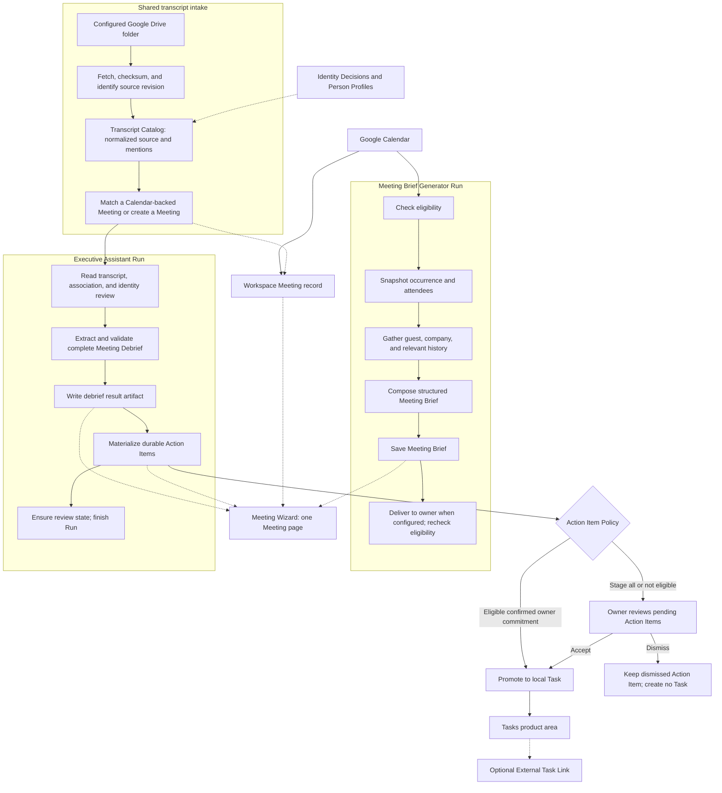
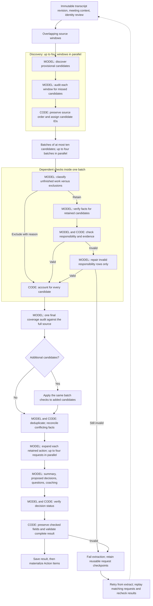

# Meeting Wizard: architecture critique brief

## 1. Start here

You are an independent architecture reviewer. This document is your full input. You do not have access to the codebase, private transcripts, test files, or earlier discussions.

Critique the design described here. Assess whether it can produce useful, reliable Meeting Briefs and Meeting Debriefs at an acceptable cost and speed. Give most attention to Meeting Debrief extraction, its recovery behavior, and its handover to Action Items.

Use the facts in this document as evidence. Label your assumptions. If a fact is missing, state what decision depends on it and how to obtain it. You can question an existing design decision, but state which decision you would change and the cost of that change.

Produce these outputs, in this order:

1. Explain the system in no more than 200 words. Identify its main ownership boundaries and its completion condition.
2. List the most important findings, in priority order. For each finding, give the relevant section of this document, the failure scenario, the effect on the owner, your confidence, a proposed change, and a test that can prove or disprove it.
3. Compare the current design with at least two plausible alternatives. Include a smaller change and a larger change. Compare extraction quality, latency, cost, recovery, and maintenance. State what evidence would make you choose each alternative.
4. Draw your recommended design in Mermaid. Mark the parts you would keep and the parts you would change.
5. Give a staged migration and validation plan. Each stage must have a measurable acceptance condition. Preserve existing Tasks and owner review decisions.
6. List the remaining questions that could change your recommendation. Distinguish essential questions from useful measurements.

Use short sentences and the terms in section 3. Give a recommendation even if some facts are missing. Treat uncertainty as a reason for a test, not as proof that a defect exists.

**Completion criterion:** your review covers ownership, model reasoning, evidence validation, latency, queues, persistence, recovery, identity, Action Item review, and evaluation. It contains concrete tests and a design recommendation. A list of general best practices is not sufficient.

## 2. Product context and scope

Found42 Chief of Staff is a local application. One person runs one instance against one Workspace and one Google account. Meeting Wizard is one product area in this application.

The owner wants to:

- Prepare for a meeting from Calendar and relevant context.
- Open one durable page for that Meeting before and after it occurs.
- Obtain a Meeting Debrief from a transcript in a configured Google Drive folder.
- See the decisions, unfinished commitments, and open questions from the meeting.
- Review proposed commitments before they become Tasks, except where a narrow owner-selected policy permits automatic promotion.
- Recover failed work without losing accepted work or paying to repeat all earlier model calls.

The immediate use case is a demo with real meeting transcripts. The broader use case is regular personal use. There is no agreed latency service-level objective, cost ceiling per meeting, or measured workload distribution in this brief. A fresh run estimate is available in section 11. It is not a service guarantee.

The system does not record or transcribe live audio in the path described here. It starts from an existing transcript file. The retrospective path must also work when no Calendar occurrence can be matched.

This is a snapshot of the local working tree, based on commit `91141f7` on branch `codex/270-judge-contract-measurement`, with uncommitted changes. It is not a description of an independently verified release on `main`. Recent latency fixes are active in the local Docker application. The scope of this review includes those fixes.

## 3. Terms and ownership

These terms come from the project's single domain glossary. Use them consistently.

| Term | Meaning and owner |
| --- | --- |
| Shell | The application that hosts Modules. It owns shared settings, the Google connection, and the machinery that runs and records work. |
| Workspace | The local directory that holds configuration, secrets, Runs, and durable product records. There is no database. |
| Module | One registered unit of application work. It supplies its own inputs, Stages, result contract, and retry or recovery plan. |
| Run | One execution owned by one Module. It has durable status, artifacts, and an append-only event log. |
| Stage | A named step in a Run. The Shell records its start, result, and failure. A model request is not necessarily a separate durable Stage. |
| Meeting Wizard | The product area that presents Meetings and their Meeting Briefs and Meeting Debriefs. It is not one combined backend Module. |
| Meeting | A durable Workspace record with its own ID, occurrence facts, participants, and owner-supplied information. A Calendar occurrence key is an attribute. The Meeting does not own a shared Brief/Debrief workflow status. |
| Eligible Meeting | A Meeting that passes the tests for generating a Meeting Brief. An ineligible Meeting can still exist and have a Meeting Debrief. |
| Meeting Brief | A structured result prepared before a meeting. It contains guest and company context, conversation starters, references, and uncertainty. |
| Transcript Catalog | The shared collection of immutable transcript revisions, source metadata, associations, extracted mentions, and identity review state. The current implementation is live, although one older glossary status label still says planned. |
| Transcript Mention | Evidence that a name or other entity string occurred in a transcript. It is not proof of identity. |
| Identity Decision | A stored review or policy decision that links a mention to a Person Profile, rejects the link, or leaves it unresolved. |
| Executive Assistant | The Module that extracts the retrospective result. Its hosted Module ID is `meeting-debrief`. |
| Meeting Debrief | The saved summary, decisions, Action Items, open questions, effectiveness assessment, and coaching from one transcript. |
| Provisional candidate | A temporary extraction observation. It is used for discovery and accounting. It is not an Action Item or a Task. |
| Action Item | A proposed commitment owned by the Workspace. It is pending, promoted to a Task, or dismissed. It retains its source and review state. |
| Task | The Workspace's canonical record of accepted work. It is open or completed and belongs to a Task List. It can also be created manually. |
| Responsible Person | The confirmed person expected to perform a Task. This field grants no access and sends no notification. |
| Action Item Policy | Either stage all proposals for review or automatically promote eligible proposals for the confirmed workspace owner. |
| External Task Link | An optional link from a local Task to an external task system. The external record does not replace the local Task. |
| Golden / Prompt Eval Gate | A hand-written expected result for a real transcript, and the model-based check against those expectations. This is separate from deterministic tests. |

## 4. System boundary and deployment

- This is a TypeScript pnpm monorepo. Its main build units are a Node server, a web UI, and shared types and schemas. These build units are not separate business domains.
- The Shell and Modules run in one server process. The app is served from one Docker image. The local application is exposed on the loopback interface; the demo URL uses port 4317.
- The design assumes one trusted owner. It does not provide the user isolation and authentication required for a shared public service.
- Each Module has a Runner. A Runner serializes that Module's Runs through one in-memory promise queue. Several model requests within one active Run can execute concurrently.
- Separate Modules have separate Runners. The four-request limit in debrief extraction is not evidence of a global application-wide provider limit.
- Durable Run records allow the Shell to rebuild lost queued work after a process restart. This is not a distributed job queue.
- The Google connection is the shared route to Google APIs. Modules do not own independent Google credentials.
- Model requests go through one shared provider interface. The measured debrief uses OpenRouter and `inception/mercury-2.5`. Other configured models can use the same interface.
- Local storage does not mean local model inference. The provider receives the transcript and the context included in each request. Detailed request and response artifacts remain in the private Workspace. Provider retention guarantees are not established in this brief.

Other product areas share the process and provider interface. Their internal designs are outside this review. Resource contention with them is in scope.

## 5. Overall pipeline

Solid arrows below mean data flow or a processing step. Dotted arrows mean presentation, association, or an optional path. The two Runs have independent inputs, state, and retry behavior.



### Meeting Brief behavior

The durable Stages are `snapshot`, `enrich`, `compose`, and `deliver`. A Meeting must be timed, not cancelled, not declined by the owner, and have at least one other non-declined attendee. Rooms and resources do not count as that attendee. Internal and external attendees can qualify.

The result is saved separately from delivery. Delivery rechecks the Calendar conditions and uses receipt and reconciliation mechanisms. A delivery retry can preserve the composed Brief. Owner-only Brief delivery is a separate path from retrospective Action Item review.

This brief gives less detail on guest research and Brief delivery than on debrief extraction. A reviewer can flag missing evidence about those paths. The debrief timings in section 11 do not measure them.

### Transcript intake and association

The Catalog checks source content and its processing ledger before registering new work. An unchanged processed revision is not mined again. A failed or interrupted attempt for the same content keeps the same revision identity. Duplicate-copy detection also exists. These are application-level duplicate controls, not a claim of an atomic transaction across Google, the Catalog, and a Run.

Association uses file-name title and date or time, with speaker names and file modification time as additional evidence. A file name with a stated time uses a two-hour tolerance; a date or modification-time signal can use a 24-hour tolerance. Exactly one qualifying Calendar-backed Meeting is required for automatic association. Zero or several qualifying Meetings leave the association unresolved. The transcript can create its own Meeting. The owner can resolve near matches later.

A transcript already attached to a Calendar-backed Meeting is not automatically rematched. A transcript-backed Meeting can be reconsidered when Calendar history becomes available. Calendar history is retained backward to the oldest transcript rather than only read forward from today.

## 6. Detailed Meeting Debrief extraction

The durable Run Stages are `associate`, `extract`, and `review`. Most of the diagram below is inside the single `extract` Stage. Request checkpoints and progress events give finer detail within that Stage.



Other requests and validators can also fail. The failure arrows illustrate the common path. Added candidates receive the same checks, but do not start an unlimited cycle of final coverage audits.

### Stage contracts

| Step | Input and output | Enforcement and limits |
| --- | --- | --- |
| Window creation | Normalized source becomes overlapping windows. Boundary turns are included whole. | Nominal width is 16,000 characters; overlap is 2,000 characters. More than 32 windows fails the extraction. Character counts are not token counts. |
| Discovery | Each window produces candidate work text, source evidence, and a speaker label. | Broad discovery includes some work that may later be completed or optional. This is a recall-oriented provisional set. |
| Window coverage | The same source section and its candidates produce missing candidates. | Evidence is checked; invalid evidence can trigger a repair. All windows are gathered in source order. |
| Candidate accounting | Candidates receive IDs derived from the source hash, window, and observation position. | More than 256 candidates fails. IDs track this extraction's observations; they are not durable Task identities. |
| Source status | Full source plus up to ten candidate observations produces retained, completed, superseded, optional, or unsupported dispositions. | Every supplied ID must be accounted for. A retained row needs an unfinished next step and grounded evidence. Excluded rows have no next step. |
| Fact verification | Full source plus retained observations produces the concrete deliverable, responsibility proposal, timing, and evidence. | The model can reject a retained observation after further review. Code checks ID accounting and result structure. |
| Responsibility verification | Full source and checked facts produce names, an explicit/inferred/unknown basis, a reason, and evidence bindings. | Code checks names, cardinality, source references, and source-name relationships. Invalid rows receive a focused repair. Missing or duplicate IDs require full accounting repair. |
| Final coverage | Full source and the verified disposition ledger produce any missed obligations. | One audit occurs after initial checks. Unique repeated quotations in the audit ledger are replaced with source IDs. Literal evidence stays in stored results. |
| Deduplication | All retained actions and the full source produce same-deliverable or separate-work groups. | A merge requires compatible responsibility and timing signatures plus grounded evidence. Repairs can correct facts for rejected groups; corrected responsibility is checked again. Unresolved proposals fail extraction. |
| Action details | Full source, checked facts, and grouped observations produce purpose, completion criteria, inputs, and dependencies. | Code restores checked title, responsibility, timing, commitment, status reasoning, and evidence after generation. The expansion cannot replace those fields. |
| Overview and decisions | Full source and the disposition ledger produce summary, proposed decisions, questions, effectiveness, and coaching. | A separate model check classifies each proposed decision. Only settled decisions remain. |
| Final assembly | The checked actions and overview become one structured Meeting Debrief. | Normalization must preserve the number of retained actions. Silent loss of a retained candidate fails extraction. |

Most status, fact, responsibility, and final-audit requests include the full transcript. Splitting discovery into windows does not eliminate repeated full-source input in later steps. High reasoning effort is explicitly requested for many validation and repair calls. Other calls use the configured provider default. Temperature is set to zero; this does not establish deterministic answers.

## 7. What validation proves

There are three different checks. They must not be treated as equivalent.

1. **Shape:** Is the answer valid JSON with the expected fields and types? The shared contract uses Zod schemas and JSON Schema for provider requests.
2. **Accounting and grounding:** Does every required ID occur correctly? Does the cited source exist? Do names and evidence bindings satisfy the code's consistency rules?
3. **Meaning:** Does the source actually support the proposed obligation, person, deadline, or decision? Models perform much of this work. A valid reference and valid JSON do not prove the claim is correct.

The model is asked to select `@line:N` source references. Code resolves them to literal transcript speech, speaker, and timestamp. Blank lines are not offered as evidence. A short `@N` form is accepted. A timestamp form such as `@line:17:42` is accepted only when that exact timestamp identifies one source turn. Ambiguous or nonexistent timestamps are rejected. Literal-quote compatibility also remains.

Some repair requests have narrower output schemas. Status repair can enumerate spoken source IDs. Responsibility repair separates explicit, inferred, and unknown cases. Runtime checks remain necessary: a measured Mercury response violated its requested schema.

The responsibility check has an important limit. Its current source-binding rule is approximately:

```text
All supplied evidence must resolve.
At least one resolved quote must satisfy one of these conditions:
  - the basis is inferred and the name is a known transcript speaker; or
  - the quote's speaker matches the proposed name; or
  - the quote mentions the name, including a unique first-name form where allowed.
```

For an unknown responsibility, names and bindings must both be empty. For a named responsibility, each name must have exactly one binding. These checks constrain the result. They do not prove that a speaker performed or accepted the particular work. The prompt asks the model to establish that relationship and to explain uncertainty.

Several checks use the same configured model and overlapping context. They are separate requests, not proven independent sources of judgment. The latest generated result has not been manually verified against the whole transcript in this investigation.

The following examples are synthetic. They express the intended behavior and contain no private transcript material:

| Transcript pattern | Intended result |
| --- | --- |
| “I will send the plan.” Later: “I sent the plan.” | Exclude the completed send. |
| “I will finish the remaining three checks tomorrow.” | Retain only the remaining work and its supported date. |
| “We could build a premium course someday.” | Keep an idea from becoming an agreed build commitment. |
| “I will market it when the materials are ready.” | Retain the conditional marketing commitment; do not invent a commitment to build all discussed materials. |
| “Can you add this?” with no clear referent | Preserve uncertainty about responsibility. |
| “I will schedule the session,” followed by discussion of the session itself | Preserve scheduling as a distinct unfinished step when it remains outstanding. |
| Two speakers share one timestamp | Require an unambiguous source turn instead of selecting a speaker by guess. |

## 8. Data contracts and the handover to Tasks

This is a compact contract sketch. It is sufficient for architectural reasoning, but is not executable TypeScript or the full API schema.

```text
Meeting
  own ID, optional Calendar occurrence key, time, title, participants

Transcript revision
  stable source revision ID, source checksum, file metadata
  immutable normalized text, speaker labels
  optional Meeting association, roster, separate identity review state

Provisional candidate
  extraction candidate ID, observed work, source span, proposed speaker

Disposition
  candidate ID, status, reason, optional merge target
  checked facts for retained work

Checked facts / action handoff
  concrete title and commitment
  responsibility: names, basis, reason
  timing: stated wording, interpretation, optional date or trigger
  literal evidence with speaker and timestamp
  status reasoning
  generated purpose
  completion criteria: text and explicit/inferred basis
  required inputs; missing information with an obtain-by proposal and basis
  dependencies: action title, condition, and explicit/inferred basis

Meeting Debrief
  summary, decisions, actions, open questions, effectiveness, coaching

Action Item
  durable ID, source Run / transcript / Meeting references
  extraction revision, proposal, handoff, identity evidence
  pending / promoted / dismissed state and decision metadata

Task
  durable local ID, Task List, accepted content, optional Responsible Person
  open / completed state, optional External Task Link
```

The Executive Assistant proposes Action Items. The Workspace owns the resulting records. Identity review resolves a source name to a Person Profile. A model-generated name alone is not a confirmed Responsible Person. Shared or unknown responsibility can remain without one confirmed person in the proposal.

The current Action Item ID is a truncated SHA-256 hash of:

```text
debrief Run ID + normalized title + normalized proposed owner name + due date
```

Normalization trims, lowercases, and collapses whitespace. Position in the output array is excluded. Evidence text and expanded action details are also excluded.

Materialization preserves an existing matching Action Item and its review state. It adds unseen proposals and tracks an extraction revision. The same ID therefore survives reordering, while a changed title, proposed owner, or date can produce a new ID. The same-content guarantee should not be read as semantic identity across arbitrary paraphrases or different Runs.

The default Action Item Policy stages proposals. The optional automatic policy is limited to eligible commitments for the confirmed workspace owner. For current rich handoffs, the policy requires an explicit commitment, explicit responsibility, exactly one named person, and nonempty evidence. Legacy proposals without a handoff can still exist; those handoff-specific conditions are conditional on the field being present. Unassigned, ambiguous, other-person, later-extraction, and possible-duplicate cases remain for review under the policy's checks. Accepted Tasks stay local and canonical even if delivery through an External Task Link fails.

Review is not a completion gate for a Meeting Debrief Run. A Run can be done while all its Action Items are pending. Retrospective email-draft creation and optional task delivery are separate owner-facing operations; successful extraction does not mean a meeting email was sent.

## 9. Persistence, retries, and concurrency

### Request checkpoints

A normal extraction can reuse exact-request responses stored in its private Run directory. The key hashes:

```text
provider/model scope
system prompt
user prompt, including source and supplied context
requested output schema
temperature
explicit reasoning effort
```

The key is not a semantic cache across different Meetings or Runs. It does not explicitly include the implementation version of a validator, the upstream route, or timeout policy. Its purpose is response reuse, not a record of identical execution conditions.

Normal responses are cached after shape validation. Downstream checks still run when those responses are reused. Repair responses are cached only when that request supplies a semantic validator and the validator passes. The validator also runs on cache reads. Repairs without such a callback are not cached. Invalid JSON checkpoint files are treated as unavailable.

This policy preserves some responses that are structurally valid but need a later repair. It does not mean every saved response is a fully accepted Action Item.

An owner-requested regeneration bypasses these checkpoints. The current implementation performs a complete extraction, then merges the requested field into the saved debrief. Regenerating only a summary can therefore incur more work than one summary request. Existing result text is not supplied as the new extraction's authority.

### Three recovery layers

| Layer | Behavior |
| --- | --- |
| Provider request | The shared provider interface classifies transport, HTTP, stream, and answer-shape failures. Eligible failures can receive one additional same-binding retry when the request budget permits. Binding fallback and route handling are also provider-interface concerns. |
| Semantic repair | Extraction asks the model to repair a specific invalid result. Most named checks have one repair opportunity. These are additional model calls, not transport retries. A remaining invalid result fails the extraction. |
| Run retry or restart recovery | The Shell re-enters a Module-selected Stage. A failed extraction can restart from `extract`, discard its result artifact, and retain matching request checkpoints. Process-orphaned work can be recovered from durable Run state. |

The provider's Result Shape Binding can use schema-constrained output, a forced tool call, or prompt-only output, based on model support and fallback policy. The observed Mercury calls used schema response format. The request still needs runtime validation.

### Limits

| Limit | Current value or behavior |
| --- | --- |
| General absolute model request ceiling | 300 seconds |
| Opted-in small request ceiling | 120 seconds; used for discovery and window coverage |
| Stream idle ceiling | 30 seconds without wire traffic |
| Stream silent-progress ceiling | 90 seconds without accepted progress; keepalives do not count |
| Maximum answer characters | 250,000 across answer surfaces |
| Discovery window budget | 32 windows |
| Candidate budget | 256 candidates |
| Concurrent extraction work | Four workers within each parallel phase |
| Whole-extraction wall-clock or token budget | No explicit bound was identified in the extraction function |
| Application-wide model concurrency budget | Not established by this inspection |

Request-local stream policy can override provider defaults. Individual request limits do not bound the complete Run, particularly when it contains many requests and repairs.

The parallel helper preserves input order. On failure, it stops scheduling new work, lets active work settle, and then throws the first failure. This prevents late artifact writes from racing an immediate retry. It also means failure return can wait for another active request. It does not cancel all active provider work as soon as one worker fails.

### Write ordering and restart behavior

Run metadata is written to a temporary file and renamed. Events are appended to a JSONL file. General Run artifacts use direct file writes. Request checkpoints use that general artifact path. The design is not a transaction over all Workspace files.

The normal completion sequence is:

```text
extract the complete validated result
write result.json
record debrief_extracted
materialize Action Items in the Workspace
ensure review state
mark the Run done
```

Restart recovery uses file presence as one signal. If a result or review artifact exists, the debrief recovery plan can enter `review`; otherwise it returns to association and extraction. The exact safety of a crash between the result write and Action Item materialization was not fault-tested in the latency investigation. Treat that as an open recovery question. The intended completion condition is that both the result and its Action Items exist.

## 10. State shown to the owner

The Meeting record does not duplicate a lifecycle state shared by both Modules. The page reads the relevant Run and Workspace records.

For a first debrief extraction with no saved Action Items:

- Queued or processing: show “Extracting action items…”.
- Failed: show that Action Items are unavailable because extraction failed.
- Successful: show the actual saved count, including zero when zero is a valid result.

There is no staged release of provisional candidates as reviewable Action Items during extraction. Model request artifacts and progress can exist before the complete debrief is available. A failed late check can therefore leave the owner without a usable new debrief, despite substantial successful work.

## 11. Measured incident and evidence limits

The September 9 meeting was processed during the September 10, 2026 investigation. The original run used `z-ai/glm-5.3-flash`. It began at 14:00:16 UTC and failed at about 14:29:57 UTC. The transcript was already available. A separate ingestion-process interruption was recovered after about three seconds; it did not explain the later half-hour delay.

The original extractor generated 89 provisional candidates. It processed independent work serially. Most later requests repeated the full transcript, often with high reasoning effort. Deduplication occurred after the expensive candidate checks.

| Original work | Approximate elapsed time |
| --- | ---: |
| Discovery and source coverage | 145 seconds |
| Source-status checks | 368 seconds |
| Fact verification | 657 seconds |
| Responsibility checks, including seven repairs | 427 seconds |
| Final coverage audit, two timed-out attempts | 180 seconds |

Successful provider attempts reported about 1,135,260 input tokens and 153,316 output tokens. The final audit request had about 228,253 user-message characters. Its disposition ledger accounted for about 135,209 of those characters. Two audit attempts reached the 90-second silent-progress limit. HTTP success and some received bytes did not establish usable progress.

The local fixes introduced bounded parallel work, request checkpoints, validated repair reuse, repairs limited to invalid responsibility rows, smaller evidence representations, better reference handling, and honest empty-state UI text.

Mercury then exposed additional answer failures: a bare discovery array, blank source references, incorrect responsibility bindings, and timestamp-shaped or ambiguous references. Several code changes and manual retries were required before completion. The final success is not evidence of first-attempt reliability.

The final Mercury Run result contained 61 accounted provisional candidates, 17 Action Items, 3 decisions, and 3 open questions. The last resumed attempt ran from 15:40:58.005 to 15:41:49.867 UTC: **51.862 seconds**. It reused 34 prior requests and made 21 new provider attempts. Reported cost for that resumed attempt was about **USD 0.0257**. It excludes the cost and time of earlier attempts.

Mercury completed the formerly failing final coverage audit in 10.924 seconds on an earlier retry. The source, candidate set, and model behavior differed from the original GLM run. A causal speedup for code changes alone has not been measured.

An estimate reconstructed from Mercury request durations puts a fresh extraction of this transcript at about **2.5–3 minutes**, with **5 minutes suggested as a demo planning allowance**. This assumes similar candidates, repairs, and provider performance. It excludes unknown queue delay. It is not a measured fresh-run result, a percentile, or an upper bound. There are no p50/p95 figures or repeated fresh-run measurements in this brief.

## 12. Verification already performed

The final reported local static and deterministic test check passed 2,509 tests across 217 files, plus TypeScript, lint, formatting, and unused-code checks. The focused candidate-accounting suite contained 51 passing tests. The Docker image rebuilt and started. The saved result and the real Meeting page showed the completed debrief and 17 pending Action Items.

Focused regressions cover:

- Parallel execution with a four-worker limit and stable output order.
- Reuse after a late failure, including validated responsibility repairs.
- Fresh attempts for invalid repairs instead of indefinite replay.
- Repairs that leave valid responsibility rows unchanged.
- Missing candidate accounting and invalid merge references.
- Preservation of literal evidence when requests use source IDs.
- Blank, nonexistent, and ambiguous source references.
- A bare discovery array that still passes the unchanged candidate contract.
- UI states for processing, failure, and successful extraction with zero Action Items.

These tests use controlled model responses for many cases. They do not measure extraction accuracy across live model outputs.

The separate Prompt Eval Gate uses the fixed Gate Model `upstage/solar-pro4` against 20 real transcript Goldens. The Goldens are written by people and are not derived from model answers. The gate was not run for the final latency changes. The private transcript corpus is not included here. That is a release-confidence gap, not evidence that every current extraction is wrong.

## 13. Existing design decisions and review questions

These decisions explain the current design. They are open to critique if you state the tradeoff.

| Decision | Original reason | Question for the reviewer |
| --- | --- | --- |
| One local instance per person | Avoid shared-account, authentication, and tenant-isolation complexity during product development. | What needs to change for the present local use case, and what only matters if deployment changes? |
| One process with registered Modules | Keep integration simple and allow reuse of the Shell. | Are per-Module queues and local worker pools enough to control contention and backlogs? |
| Durable Meeting; separate Brief and Debrief Runs | Calendar preparation and transcript analysis have different inputs and retries. Past Meetings must survive Calendar's forward window. | Are ownership and association rules sufficient without adding a competing shared lifecycle state? |
| Broad candidate discovery before repeated validation | Reduce omissions and preserve small or conditional commitments. | Does the extra recall justify cost, correlated reasoning errors, and repair complexity? |
| Deduplicate after checking candidates | Avoid prematurely merging separate obligations that mention one project. | Can duplicate work be reduced earlier while preserving distinct actions and evidence? |
| Fail the whole extraction when accounting or evidence remains invalid | Avoid presenting silent omissions as complete output. | Would a clearly incomplete result with unresolved items serve the owner better? What must remain gated? |
| Exact-request checkpoints | Avoid redoing expensive successful calls after a late failure. | What is the right checkpoint unit, versioning rule, and invalidation policy? |
| Full extraction for field regeneration | Keep fresh extraction grounded in immutable input rather than a rejected answer. | Can field-level regeneration preserve that property with less cost and less effect on Action Item identity? |
| Workspace-owned Action Items and Tasks | Keep accepted work independent of a Run and external task services. | Are identity, revision, and reconciliation rules sufficient for paraphrases, changed owners, and corrections? |
| Shared model interface and request limits | Centralize failures, schema binding, routing, and request budgets. | What operation-level budget, cancellation, admission control, and telemetry are also needed? |

Also assess these questions:

- Which checks can be deterministic, and which need model judgment?
- Does source grounding give the owner enough evidence to review a disputed action?
- How should the system measure and reduce false actions, missed actions, wrong responsibility, wrong dates, and wrong merges separately?
- How should confidence or unresolved evidence affect completion without hiding uncertainty?
- Which crash points need idempotency tests or a stronger commit protocol?
- What are the retention and privacy costs of repeated full-source requests and detailed private artifacts?
- What is the smallest experiment that can distinguish a simpler extractor from the current multi-pass design?
- What fresh-run measurements and quality gates are required before making a latency promise?

## 14. Provenance and known missing information

This document was prepared from the domain glossary, architecture decisions, implementation, tests, and the retained latency investigation. The reviewing agent does not need to open any of these sources. Their relevant behavior is included above. Paths below identify the evidence for a future implementer; they are not hidden prerequisites for your review.

| Source within the repository | What it informed |
| --- | --- |
| `CONTEXT.md` | Domain terms and ownership |
| `docs/adr/0001-local-first-single-user.md` and `0002-modules-as-registry-in-one-process.md` | Deployment assumptions and shared process |
| ADR-0050, “The Workspace owns a durable Meeting” | Meeting identity, Calendar history, and separate Runs |
| `apps/server/src/transcript-catalog/catalog.ts` and `apps/server/src/meetings/{matching,join}.ts` | Revision processing and association |
| `apps/server/src/modules/meeting-brief-generator/{module,eligibility}.ts` | Brief Stages and eligibility |
| `apps/server/src/modules/meeting-debrief/{module,candidate-extraction,extraction}.ts` | Extraction, validation, checkpoint use, regeneration, and completion |
| `apps/server/src/engine/runner.ts` and `apps/server/src/runs.ts` | Queue, recovery, events, and artifact writes |
| `apps/server/src/tasks/{action-items,auto-promotion}.ts` | Action Item identity and automatic promotion policy |
| `packages/shared/src/{meeting-debrief,llm}.ts` and `apps/server/src/llm/providers.ts` | Contracts, request limits, and model interface |
| `tests/src/modules/candidate-accounting.test.ts` | Controlled extraction regressions |
| `tests/e2e/meeting-extraction-progress.spec.ts` | Meeting-page state regression |
| `docs/research/september-9-debrief-latency-2026-09-10.md` | Incident measurements and live result |

Missing measurements include fresh-run success rate, quality scores for the final changes, latency percentiles, the normal transcript-size distribution, daily arrival rate, queue delay, operation cost across all retries, and crash-injection results around final writes. Exact provider retention terms and an application-wide resource budget are also not established here.

Treat these as explicit limits of the evidence. Finish the review using the supplied facts, then identify which missing measurements could change your recommendation.
