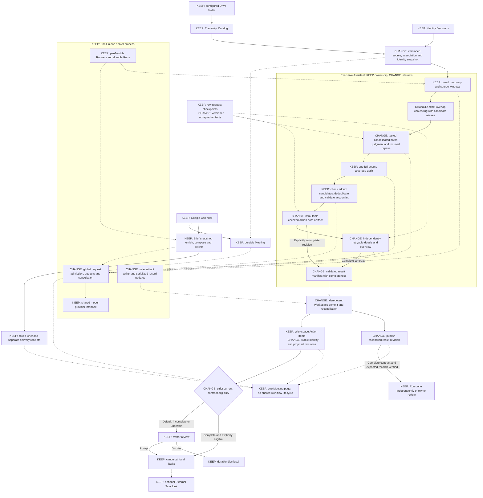

# External review of the Meeting Wizard architecture

## 1. System explanation and recommendation

Meeting Wizard presents a durable Meeting page. It does not own one combined Brief/Debrief workflow.

The **Shell** owns shared settings, the Google connection, model access, and Run machinery. Each **Module** owns its inputs, Stages, result contract, and recovery plan. The **Transcript Catalog** owns immutable transcript revisions and their associations. Identity Decisions remain separate from names found in speech. The **Workspace** owns Action Items and accepted Tasks.

The Meeting Brief Generator prepares context before a meeting. It saves the Brief separately from delivery. The Executive Assistant extracts a Meeting Debrief and proposes Action Items. Owner review normally decides which proposals become Tasks.

A Debrief Run should finish only when its complete validated result, corresponding durable Action Items, and review state exist. Pending owner review does not prevent completion. Email delivery and External Task Links are separate.

**Recommendation:** Keep these ownership boundaries and the single-process deployment. Strengthen publication, reconciliation, and promotion first. Then test a less expensive extraction pipeline. Do not migrate to a database or distributed queue without evidence that the smaller design is insufficient.

## 2. Findings, in priority order

This is a document-only review. I did not inspect the implementation, execute tests, or verify the private transcript. “High confidence” below can mean that a design limitation is documented. It does not mean its possible failure has occurred.

### F1. Make durable completion a checked invariant, not an inference from file presence

**Relevant sections:** 9–10. **Confidence:** High that the recovery boundary needs validation; unknown whether the current implementation mishandles it.

General artifacts use direct writes. Completion crosses several files and records. Recovery can select `review` based partly on artifact presence. The critical crash interval has not been fault-tested.

**Failure and owner impact:** A crash leaves a partial result file, a complete result without Action Items, or only some materialized Action Items. Recovery treats the artifact as sufficient evidence to advance. The owner sees “done” with missing proposals, or receives duplicate proposals after another attempt.

**Proposed change and cost:** Introduce an immutable extraction manifest and an idempotent commit/reconciliation operation. The manifest should record the result checksum, contract and validator versions, completeness, and the expected mapping from each output action to its durable Action Item.

The Module owns the completion check. The Shell supplies safe artifact-writing and serialized record-update primitives. Recovery validates the manifest and repairs missing writes before marking the Run done. File presence alone must not establish completion.

This retains file storage. It adds a commit protocol and tests. It does **not** make all files one atomic transaction.

**Decisive test:** Interrupt execution before and after every final write, including midway through materialization. Recover twice. The expected Action Items must exist exactly once. Review decisions must survive. A corrupt artifact must never produce a completed Run. Once a complete result is durably prepared, materialization recovery should require no model calls.

### F2. Separate durable Action Item identity from mutable proposal content

**Relevant sections:** 8–9. **Confidence:** High about identity instability; duplicate incidence is unmeasured.

The current ID depends on Run ID, normalized title, proposed owner, and date. It survives reordering, but not arbitrary paraphrases, changed facts, or different Runs.

**Failure and owner impact:** A retry with changed wording produces a second proposal for accepted work. A new Run brings back dismissed work. Conversely, two distinct obligations with the same title, owner, and date could have identical identity inputs within one Run. That risk is separate from a cryptographic hash collision.

**Proposed change and cost:** Keep existing IDs unchanged. Treat them as opaque durable identifiers. Allocate opaque IDs for new Action Items.

Store proposal revisions and source-observation mappings separately. Use a materialization key for exact retry idempotency. Handle semantic reconciliation across extractions as a different operation. A proposed match may attach new evidence or propose an amendment; it must not silently rewrite a Task or reverse a dismissal.

Ambiguous matches remain for owner review. A repeated commitment in a later Meeting must not automatically collapse into an earlier obligation.

The cost is a reconciliation ledger, revision history, and some additional review.

**Decisive test:** Reorder actions, paraphrase a title, change an owner or date, rerun the same transcript in a new Run, and process a later recommitment. Include two distinct actions with identical display fields. Existing Tasks and review decisions must remain unchanged. Every ambiguity must be visible rather than resolved through accidental ID equality.

### F3. Tighten the transition from grounded text to an automatically created Task

**Relevant sections:** 7–8. **Confidence:** High about the validation limit; actual wrong-owner frequency is unknown.

The responsibility rule verifies source relationships, not acceptance of the particular obligation. The brief explicitly distinguishes grounding from meaning. Legacy proposals also receive fewer handoff-specific automatic-promotion checks when the handoff is absent.

**Failure and owner impact:** “Alex: Jordan will send the report” is cited as evidence that Alex owns the work. The reference resolves, Alex is the speaker, and the output has the right shape. A mistaken semantic judgment could still produce an owner Task.

**Proposed change and cost:** Store a structured responsibility claim that distinguishes the speaker, proposed performer, commitment or assignment, and supporting turns. Require the semantic check to evaluate that relationship and relevant later updates.

Code can validate references and consistency. It cannot prove acceptance from those references.

Automatic promotion should additionally require a current supported handoff contract, confirmed owner identity, satisfied existing eligibility rules, and no unresolved reconciliation or completeness warning. Legacy or incomplete handoffs should go to review. Do not use the model’s self-reported confidence as permission to promote.

The cost is extra review for uncertain and legacy proposals. For the immediate demo, keep automatic promotion disabled until the quality gate passes.

**Decisive test:** Contrast first-person commitments with reported commitments, requests without acceptance, shared responsibility, cancellations, and quoted speech. Include absent legacy handoffs. Unsupported owner responsibility must never trigger automatic promotion.

### F4. Establish a live quality baseline before interpreting the latency fixes as release readiness

**Relevant sections:** 7, 11–12. **Confidence:** High that release evidence is incomplete; no conclusion that extraction quality is poor.

The final result was not manually checked against the whole transcript. The reported 51.862-second attempt reused 34 requests. Its cost excludes earlier attempts. The Prompt Eval Gate was not run for the final changes.

**Failure and owner impact:** A fast resumed success becomes an informal promise of fast, reliable fresh extraction. The demo instead encounters new repairs, incorrect commitments, or a failed first Run.

**Proposed change and cost:** Freeze the actual working-tree revision, configuration, and prompt/schema versions. Run the 20 Goldens. Add repeated cold Runs with empty request checkpoints.

Measure false actions, missed actions, wrong responsibility, wrong dates, wrong merges, false decisions, and unsupported handoff details separately. Report first-Run completion without manual intervention alongside latency. Include all provider retries and semantic repairs in cost.

Human review should adjudicate disagreements and audit some passing results. The Gate Model is an evaluator, not final authority.

The cost is evaluation time and model spend.

**Decisive test:** Compare the frozen current design with a candidate change on identical transcript revisions and context snapshots. A faster design fails the release gate if it introduces a critical semantic regression, even when every schema and accounting test passes.

### F5. Add application-wide admission control and whole-operation budgets

**Relevant sections:** 4, 9, 11. **Confidence:** High about the control gap; contention under normal use is unmeasured.

Per-Module queues and four-worker extraction pools do not establish a global provider limit. Individual request ceilings do not bound a whole extraction. Character-based window limits also do not establish that later full-source requests fit the configured model.

**Failure and owner impact:** A long Debrief delays every later Debrief. Other Modules simultaneously increase provider load. Repairs keep accumulating cost within otherwise valid request limits. A late request becomes too large after earlier calls have already been paid for.

**Proposed change and cost:** Put request admission in the Shell’s shared provider path. Apply it to normal attempts, retries, repairs, and fallbacks. Start with a configurable concurrency cap and fair scheduling. Give time-sensitive work priority without permanently starving background work.

Add queue age, execution deadline, input/output-token budgets, and estimated-spend limits. Automatic recovery must share the operation’s budget. An owner-authorized extension should be explicit, with accumulated cost still visible.

Preflight each request against a token allowance, including its ledger and output reserve. Never truncate source or candidates silently.

The cost is scheduler complexity and possibly slower isolated Runs in exchange for controlled contention.

**Decisive test:** Run Briefs and Debriefs concurrently against a controlled provider with delays and rate limits. Verify the global cap, bounded retries, visible queue delay, and recovery after cancellation. Retain the current settle-before-retry behavior until cancellation and stale-write prevention are proven.

### F6. Reduce repeated reasoning only through a quality-controlled experiment

**Relevant sections:** 6–7, 11. **Confidence:** High about duplicated input; uncertain which passes are dispensable.

Many checks repeatedly receive the full transcript. Several use the same model and overlapping context. Deduplication follows expensive candidate checks. These are documented costs, not proof that the checks have no value.

**Failure and owner impact:** The owner pays repeatedly for overlapping evidence while correlated judgments preserve the same mistake. Parallelism reduces waiting but does not remove submitted input.

**Proposed change and cost:** Keep broad discovery and the full-source coverage audit initially. First coalesce exact overlap observations while preserving every original candidate ID as an alias in the accounting ledger.

Then trial one batch judgment for status, facts, and responsibility. Preserve deterministic accounting and reference checks. Use focused semantic challenges for disputed or high-risk rows. Sample exclusions too; otherwise a cheaper extractor can conceal a recall loss.

Do not perform early semantic merging merely because two obligations concern one project. Retain global completion, contradiction, and deduplication checks.

The cost is a second extractor variant and a controlled comparison.

**Decisive test:** Use examples where a later turn completes earlier work, where scheduling remains separate from attendance, and where identical project names conceal distinct deliverables. Compare quality and total tokens, not just final Action Item counts.

### F7. Separate usable checked work from optional enrichment, without presenting incomplete extraction as complete

**Relevant sections:** 6, 9–10. **Confidence:** High that late failure currently withholds the new result; benefit depends on failure frequency.

The complete result is assembled before publication. A late failure can leave the owner without a usable new Debrief despite substantial successful work.

**Failure and owner impact:** Coaching or expansion fails after Action Items have passed critical checks. The owner cannot review the checked commitments.

**Proposed change and cost:** Introduce an explicitly incomplete Meeting Debrief revision. Initially publish it only after the action core has passed source-status, responsibility, accounting, full-source coverage, and deduplication checks. Allow failed enrichment to retry separately.

Show which sections remain unavailable. Keep the Run incomplete until the full required contract passes. No provisional candidates become Action Items. No automatic promotion occurs from an incomplete revision.

A complete Debrief may legitimately contain unknown responsibility or conditional timing. Those are valid uncertainties, not necessarily failures. Missing accounting or unsupported named responsibility is different.

The cost is section-level completeness metadata and additional UI/recovery states.

**Decisive test:** Fail coaching after the action core commits. The checked proposals remain reviewable, the page clearly says the Debrief is incomplete, and retry performs no action extraction. A failed global accounting check must not take this publication path.

### F8. Keep raw-response reuse, but add versioned accepted artifacts and targeted regeneration

**Relevant sections:** 9, 13. **Confidence:** High about regeneration cost; stale accepted-artifact behavior is not established.

The cache is intentionally an exact-request response cache. Downstream checks rerun. Validator version is not explicitly part of its key. Field regeneration currently performs complete extraction.

**Failure and owner impact:** Regenerating a summary repeats unrelated extraction. Future reuse of accepted intermediate results could also become unsafe if it lacks dependency and validation versions.

**Proposed change and cost:** Distinguish a cached response from an accepted artifact.

Keep raw responses reusable when their request contract matches. Revalidate them under current rules. Add accepted artifacts keyed by source revision, association/identity snapshot, upstream artifact hashes, and relevant contract/validator versions. Record actual route and binding as provenance. A changed timeout alone need not invalidate an otherwise usable answer.

Give the Module a small dependency map. Regenerate a summary from immutable source and relevant checked facts, without treating the rejected summary as authority or rerunning action discovery.

The cost is artifact versioning and dependency-aware invalidation. It does not require turning every model call into a durable Stage.

**Decisive test:** Change a validator while keeping the prompt constant. The cached response must be rechecked. Corrupt a checkpoint. It must be recomputed safely. Regenerate only the summary and verify that Action Item IDs, review decisions, and Tasks remain unchanged.

### F9. Preserve association and time uncertainty through extraction and review

**Relevant sections:** 5, 8. **Confidence:** High about ambiguity in the described signals; no measured misassociation rate.

Automatic association requires exactly one qualifying Meeting, but some signals allow broad time tolerances. A Calendar-backed association is not automatically rematched.

**Failure and owner impact:** A unique but incorrect match supplies the wrong participants or meeting date. “Tomorrow” acquires a wrong due date. A later association correction leaves earlier proposals looking more certain than their original evidence justified.

**Proposed change and cost:** Record association provenance and a versioned extraction snapshot. Uniqueness should not by itself establish confidence. Weak filename or modification-time matches can remain unresolved while the transcript-backed Meeting still receives a Debrief.

Interpret relative dates only from a recorded meeting-time anchor and timezone. File modification time should not silently become meeting time. Preserve stated wording when interpretation is uncertain.

Reassociation must not rekey Action Items or silently change Tasks. A name mention remains separate from an Identity Decision.

The cost is more visible uncertainty and occasional owner confirmation.

**Decisive test:** Use delayed uploads, absent Calendar history, two similar Meetings, ambiguous names, and timezone-boundary dates. Correct the association after accepting a Task. The historical extraction and accepted Task must remain intact; any proposed correction must be explicit.

### F10. Treat generated handoff details as recommendations unless the transcript supports them

**Relevant sections:** 6, 8. **Confidence:** High that this distinction matters; current error rate is unknown.

Action expansion preserves checked fields, but also generates purpose, completion criteria, inputs, and dependencies. Dependencies are described using action titles.

**Failure and owner impact:** A valid commitment gains an invented prerequisite, unnecessary deliverable, or unsupported completion standard. The Task title stays correct while its instructions change the work. A title-based dependency points to the wrong similarly named action.

**Proposed change and cost:** Visually and structurally separate transcript-supported requirements from suggested execution details. Preserve explicit/inferred labels through promotion, not only in the Debrief.

Resolve internal dependencies to stable Action Item references after reconciliation. Preserve unresolved or external dependencies without inventing a target. An “obtain-by” suggestion must not silently become an additional commitment.

The cost is richer provenance and clearer review UI.

**Decisive test:** Supply a commitment with no agreed implementation method. Expansion may suggest a method, but must not describe it as agreed. Rename an action and include duplicate titles; dependency references must remain correct or explicitly unresolved.

### F11. Validate Meeting Brief usefulness and delivery separately

**Relevant sections:** 5, 11–12. **Confidence:** High that Debrief measurements do not establish Brief quality or reliability.

The Brief path already separates composition from delivery and rechecks eligibility. The document provides less evidence about enrichment and delivery than extraction.

**Failure and owner impact:** A composed Brief becomes stale after Calendar changes. Delivery recovery duplicates a message. Guest research is structurally valid but irrelevant or unsupported.

**Proposed change and cost:** Keep the existing separation and receipt/reconciliation mechanisms. Add explicit freshness and provenance to researched context. Give Brief generation and delivery their own measurements and acceptance tests.

Do not create a shared Meeting lifecycle to solve these issues. The page can present the Brief Run, Debrief Run, and current Meeting facts separately.

The cost is a focused test suite and human usefulness rubric, not a new backend architecture.

**Decisive test:** Cancel the Meeting or change eligibility after composition but before delivery. Interrupt delivery after external acceptance but before the local receipt is saved. Recovery must follow reconciliation rather than blindly resend. Separately assess context accuracy, relevance, and uncertainty on representative Briefs.

### F12. Make privacy exposure and diagnostic retention explicit

**Relevant sections:** 4, 9, 14. **Confidence:** High that provider retention is unestablished; no evidence of an actual privacy incident.

Local storage does not imply local inference. Transcript content and context reach the provider, and detailed artifacts remain in the Workspace. Retention guarantees are not established.

**Failure and owner impact:** The owner misunderstands where meeting content travels. Debugging creates unnecessary persistent copies. Transcript text is mistakenly treated as operational instruction.

**Proposed change and cost:** Document approved provider routes, transcript-use authorization, and retention behavior. Separate bounded metadata telemetry from private request/response artifacts. Define deletion and backup behavior while preserving accepted Task provenance.

Treat transcript content as untrusted evidence, not instructions. Keep authorization, promotion, and state transitions in code.

The cost is retention controls and potentially fewer retained raw artifacts. This does not justify adding multi-tenant infrastructure to the current trusted local deployment.

**Decisive test:** Verify which artifacts remain after deletion and backup restoration. Confirm ordinary logs contain no transcript text or credentials. Insert instruction-like text into a synthetic transcript; it must not alter policy, invoke tools, or change completion rules.

## 3. Current design versus two alternatives

### Recommended target: Alternative A, introduced behind quality gates

The following are proposed designs, not measured results. The current pipeline, repeated full-source use, checkpoint behavior, and estimated fresh latency come from the brief.

| Dimension          | Current multi-pass design                                                                      | Alternative A: smaller change                                                                                                                        | Alternative B: larger change                                                                                                                                  |
| ------------------ | ---------------------------------------------------------------------------------------------- | ---------------------------------------------------------------------------------------------------------------------------------------------------- | ------------------------------------------------------------------------------------------------------------------------------------------------------------- |
| Structure          | Many checks inside `extract`; exact-request checkpoints.                                       | Keep Modules, file storage, and Run Stages. Add commit reconciliation, accepted artifacts, and a consolidated batch judgment.                        | Durable dependency graph of extraction units plus a transactional Workspace record store. Raw transcripts and large artifacts may remain files.               |
| Extraction quality | Broad discovery and repeated checking. Live accuracy remains unmeasured for the final changes. | Preserve discovery and global source checks. Test whether fewer judgments retain quality. Consolidation could lose errors caught by separate passes. | Enable finer rechecking and explicit uncertainty propagation. Selective context could miss distant completion or contradiction evidence.                      |
| Latency            | Fresh estimate is 2.5–3 minutes for one transcript, excluding unknown queue delay.             | Expected reduction from fewer full-source passes and targeted regeneration. Must be measured.                                                        | More granular scheduling and recovery. No guaranteed reduction in model critical-path latency.                                                                |
| Cost               | Repeated source input, per-action expansion, and repairs.                                      | Reduce repeated input and unnecessary regeneration. Retain expensive checks where measured value justifies them.                                     | Potential savings through selective context and selective recomputation, offset by substantially greater engineering cost.                                    |
| Recovery           | Replay matching requests within a retried Stage. Final publication needs fault testing.        | Replay raw responses and reuse accepted artifacts. Reconcile a manifest into durable records.                                                        | Resume individual graph units. Commit related canonical records transactionally. Provider calls still cannot be made exactly-once merely by changing storage. |
| Maintenance        | Numerous prompts, schemas, repairs, and a broad Stage.                                         | Fewer reasoning contracts, but added artifact/reconciliation contracts.                                                                              | More machinery: migrations, graph versioning, dependency invalidation, scheduling, and transaction boundaries.                                                |

**Choose the current extractor, with recovery hardening,** when the paired experiment shows that separate passes materially reduce missed or false obligations and the complete-operation cost and latency are acceptable. Do not remove useful checks merely because they are numerous.

**Choose Alternative A** when quality is maintained and total input, cost, or latency improves materially. This is my recommended target. It addresses the demonstrated inefficiency without replacing the application’s deployment model.

**Choose Alternative B** when evidence shows that file-based reconciliation remains difficult to make safe, overlapping owner edits become common, or useful recovery requires many independently durable work units. Long transcripts that cannot be handled economically by repeated full-source checks would also justify investigating selective context.

A database would address some persistence coordination. It would not fix wrong responsibility, poor discovery, or incorrect semantic merging. A dependency graph would improve restart granularity. It would not establish extraction accuracy.

### Smallest useful extraction experiment

Select six Goldens covering dense commitments, later completion, conditional work, ambiguous responsibility, repeated project references, and a long transcript. Run the current extractor and Alternative A three times each with empty checkpoints: **36 cold Runs**.

Keep source revisions, context snapshots, model configuration, and budgets fixed. Blindly adjudicate output differences. Include valid additional actions missing from a Golden rather than automatically treating them as false positives.

Advance Alternative A only when it produces no new critical semantic errors and shows a meaningful efficiency improvement. A proposed threshold is at least **25% less total input or cost**, with no material latency regression. This is an experimental acceptance threshold, not a measured capability.

## 4. Recommended design

“KEEP” preserves ownership or an existing safeguard. “CHANGE” identifies a new contract or behavior. The consolidated judgment is enabled only after the comparison above passes.

The incomplete revision is not a successful complete Debrief. Its Action Items are available only after the action core passes its critical checks. It cannot trigger automatic promotion.

The Shell does not learn Debrief-specific reasoning rules. The Executive Assistant supplies its dependency map, validation rules, and recovery plan.

## 5. Staged migration and validation plan

All thresholds below are proposed acceptance conditions. None is a claim that the current system already meets them.

### Stage 0 — Freeze evidence and establish the baseline

Capture the commit, uncommitted diff, configuration, prompts, schemas, model binding, and source/context hashes. Back up the Workspace and test restoration. Keep automatic promotion disabled.

Run the existing deterministic suite and the 20-Golden Prompt Eval Gate. Perform three cold repetitions of the incident transcript.

**Acceptance:** The snapshot can be reproduced and restored. Every evaluation outcome is recorded. No failed Run disappears from the denominator. Record existing Task content, completion state, Action Item IDs, and review decisions for later preservation checks.

### Stage 1 — Prove publication and promotion recovery

Add the manifest, safe artifact writes, idempotent materialization, and completion verifier. Apply the same discipline to the acceptance boundary between Action Item promotion and Task creation.

Exercise process termination, truncated files, disk-full errors, interrupted event appends, and crashes between Task creation and promotion-state recording.

**Acceptance:** Every crash fixture converges after repeated recovery to the expected records with no duplicate Task and no lost review decision. No Run is done with an invalid result or missing expected Action Item. A fully prepared result can finish materialization without a provider request.

Process-crash tests do not establish power-loss safety. Define the supported filesystem durability assumptions separately.

### Stage 2 — Introduce stable identities without rekeying existing records

Keep all current IDs. Add proposal revisions, materialization keys, source mappings, and explicit reconciliation outcomes. Serialize conflicting Workspace updates or reject them through expected-version checks.

**Acceptance:** Existing Task content, completion state, IDs, and review decisions survive no-op retries, changed ordering, new Runs, paraphrases, and reassociation. Distinct same-title obligations remain distinct. A concurrent owner decision is preserved or produces a visible conflict; it is never silently overwritten.

A later transcript may propose a Task amendment. It must not silently complete, delete, or reassign accepted work.

### Stage 3 — Add budgets and a reconstructable execution timeline

Instrument operation, Run, request, repair, cache, and commit boundaries. Record queue wait, provider wait, actual request duration, cache reuse, token usage, known or estimated cost, failure category, validation result, and commit state.

Use hashes and identifiers in ordinary telemetry. Keep private content in separately governed artifacts.

**Acceptance:** Every provider attempt belongs to a Run and operation. Automatic retries and repairs consume the same budget. A multi-Module load test obeys the configured global cap. Cancellation and recovery produce no stale writes. An investigator can explain the final state and cumulative cost without reading raw transcript text.

### Stage 4 — Add accepted artifacts, targeted regeneration, and incomplete publication

Create versioned artifacts for checked action facts and complete results. Regenerate only affected sections. Initially allow incomplete publication only when the action core has fully passed critical checks.

**Acceptance:** A failed enrichment preserves checked Action Items and leaves the Run visibly incomplete. Retrying enrichment performs no action discovery. Summary regeneration leaves Action Item and Task state unchanged. Changed validators recheck dependent artifacts. No incomplete revision automatically creates Tasks.

### Stage 5 — Run the 36-Run extraction comparison

Test Alternative A against the frozen current extractor. Use equal budgets and cold checkpoints. Adjudicate all material disagreements.

**Acceptance:** No newly introduced critical false commitment, wrong-owner assignment, wrong date, or destructive merge. Report per-category error counts and denominators. Require the agreed efficiency improvement before enabling consolidation by default. Preserve the current extractor as a fallback during rollout.

### Stage 6 — Validate the complete owner experience

Expand the selected design to three cold repetitions of all 20 Goldens. Run Brief eligibility and delivery-recovery tests separately. Include a controlled backlog with other Modules active.

A proposed demo gate is:

* At least **95% of cold Runs complete without manual retry**, including their automatic repairs and retries.
* Empirical **p95 processing time at or below five minutes** on this corpus, with completion rate and queue delay reported alongside it.
* No critical semantic regression, no preservation failure, and complete accounting of cost across failed and successful attempts.

These are corpus-specific targets, not a workload guarantee. The brief’s five-minute allowance is only a planning estimate.

Report total spend divided by successful completions, including money spent on failed operations. Do not present only the successful resumed-attempt cost. Keep automatic promotion review-only until its dedicated fixtures and live-output audit pass.

## 6. Remaining questions that could change the recommendation

### Essential questions

| Question                                                                                                                          | Decision affected                                                                             | How to obtain the answer                                                                           |
| --------------------------------------------------------------------------------------------------------------------------------- | --------------------------------------------------------------------------------------------- | -------------------------------------------------------------------------------------------------- |
| What durability is promised: process restart, container restart, host crash, or power loss? Which filesystem holds the Workspace? | Whether the file commit protocol is sufficient and what “durable” can honestly mean.          | Inspect deployment and storage configuration. Run fault tests against that environment.            |
| Can extraction, owner review, manual Task edits, and promotion write the same records concurrently?                               | Required serialization, expected-version checks, and possible need for transactional storage. | Trace Workspace write entry points and run concurrent-update fixtures.                             |
| How should corrected, repeated, completed, and previously dismissed obligations relate across Meetings and transcript revisions?  | Reconciliation rules and stable Action Item identity.                                         | Review representative histories with the owner and write explicit expected outcomes.               |
| What evidence authorizes automatic owner promotion, especially for legacy proposals and changed Identity Decisions?               | Whether automatic promotion can safely be enabled.                                            | Inspect every eligibility branch and create fixtures for each contract version and identity state. |
| What meeting-time and timezone evidence exists when Calendar association is absent or weak?                                       | Whether relative dates can be interpreted or must remain unresolved.                          | Inspect source metadata and normalized revision records. Test delayed uploads and ambiguous dates. |
| What latency, spend, and incompleteness are acceptable for the demo and regular use?                                              | Budget defaults, admission policy, and whether Alternative A is sufficient.                   | Agree on a written operating contract using measured cold Runs, not the resumed attempt.           |
| Are real transcripts authorized for every provider route, and what retention and deletion behavior applies?                       | Whether the real-transcript path should run under the configured bindings.                    | Review actual routing configuration, applicable provider terms, and Workspace retention controls.  |

### Useful measurements

The most useful additional measurements are transcript token distribution, candidate density, duplicate-observation rate, repair frequency by validator, queue arrival patterns, and time spent on each dependency path.

Also measure how often failures occur **after** the action core could have been published. That determines the value of incomplete publication. Measure owner editing, dismissal, and duplicate-resolution rates. They reveal whether technically valid handoffs are genuinely useful.

Finally, measure the Gate Model’s disagreement with human review, including apparently passing outputs. This determines how much release confidence the Prompt Eval Gate deserves.

**Overall judgment:** The supplied design is a reasonable local architecture with several valuable safeguards. Its ownership boundaries should remain. The strongest next investment is not more model passes or more infrastructure. It is a provable result-to-Action-Item commit, durable identity across revisions, and a cold-run quality baseline. Those provide the evidence needed to simplify extraction without sacrificing the owner’s accepted work.
