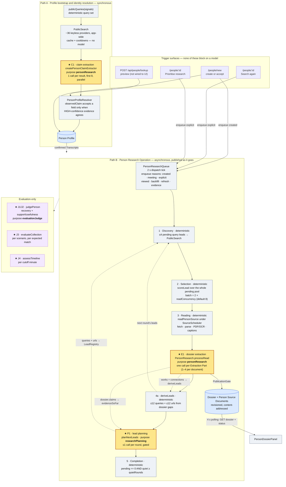
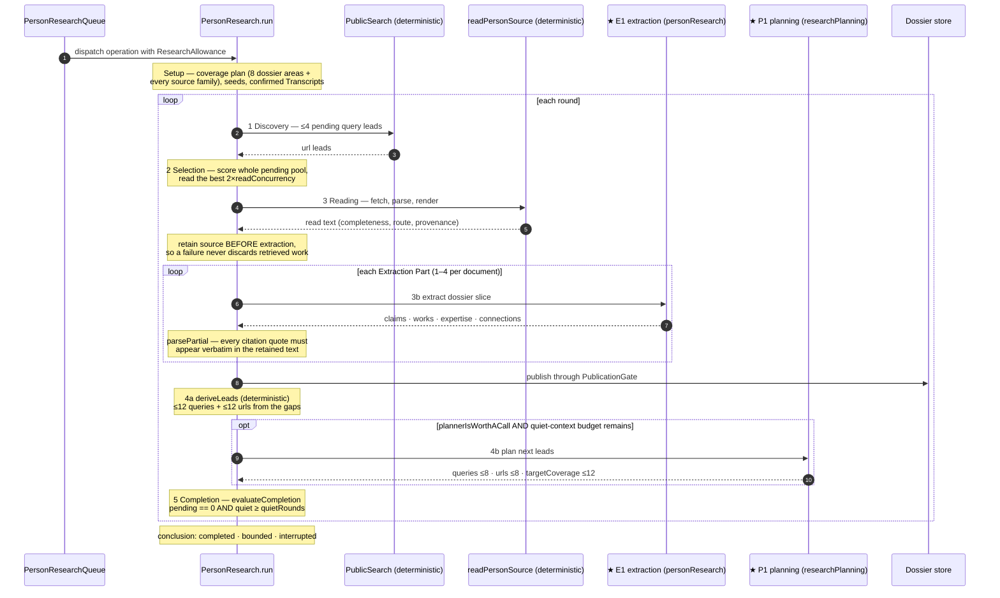
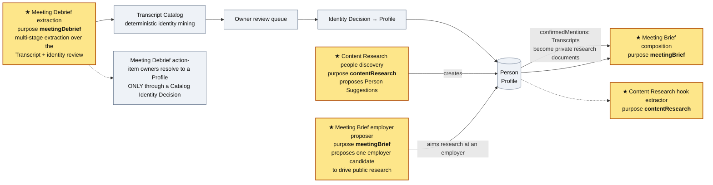

# Where the models are: LLM usage in the Person Profile workflow

An architectural map of every LLM call in the Person Profile workflow — what each call is
for, the order it runs in, and how the calls relate to each other.

Measured against `main` at the time of writing. Every call site below names the symbol that
makes the call, so the map can be re-derived rather than trusted.

## 1. Reading guide

Vocabulary is `CONTEXT.md`'s: **Person Profile**, **Person Research Operation**, **Extraction
Part**, **Identity Signal**, **Person Evidence**, **Person Source Document**.

Three things are worth knowing before the diagrams:

1. **One seam.** Every model call in the app goes through `CompleteJson`
   (`apps/server/src/llm/providers.ts`), built by `makeCompleteJson`. A call names a *purpose*,
   not a model: `configStore.getForPurpose(purpose)` (`apps/server/src/config.ts`) resolves it
   to the provider/model the owner configured. The purposes are the `MODEL_PURPOSES` map in
   `packages/shared/src/schemas.ts`.
2. **Very few call sites.** The Person Profile product has **exactly three** model call sites,
   all in `apps/server/src/person-profile/`. Everything else in the product — collection,
   reading, identity, scoring, storage, queries — is deterministic.
3. **The model proposes; it never decides.** Identity, completion, dedupe, dating, authority
   and publication are all recomputed from durable records. No model output is trusted for any
   of them. This is the workflow's central design rule and it is why three call sites are
   enough.

## 2. Master map

`★` marks a model call. Solid edges are data; dashed edges are the feedback that makes the
operation iterative.

## 3. Order: one research round

`PersonResearch.run` is `while (active() && budget.within())`. Model calls happen in stages 3b
and 4b only.

## 4. Call-site reference

### 4.1 Production — the three call sites

| | **C1** | **E1** | **P1** |
|---|---|---|---|
| Symbol | `createPersonClaimExtractor` | `PersonResearch.processRead` | `planNextLeads` |
| File | `person-profile/claims.ts:39` | `person-profile/research.ts:854` | `person-profile/research-plan.ts:471` |
| Purpose | `personResearch` | `personResearch` | `researchPlanning` |
| Path | A · bootstrap | B · research | B · research |
| Trigger | one per public search result, first 8 | one per Extraction Part, per document, per round | ≤1 per round |
| Concurrency | `Promise.all` over the first 8 | documents parallel under `WorkLimiter(4)`; **parts sequential within a document** | shares `WorkLimiter(4)` |
| Result shape | `ClaimsSchema` `{fullName, role, currentEmployer}` | `Extraction` = `PersonDossierContentSchema` + `{fullName, employer, sourceClass, author, publishedAt}` | `PlanSchema` `{queries ≤8, urls ≤8, targetCoverage ≤12, remainingQuestions ≤10}` |
| The question asked | "What does this one search result state about this person?" | "Extract a sourced dossier from this one untrusted document slice." | "What should be searched or read next to fill these gaps?" |
| Bounds | `MAX_CLAIM_EXTRACTIONS = 8`; small-call ceiling 120 s | per-part `budget.takeModelCall()`; `ExtractionHealth` latches after 3 consecutive boundary failures | `plannerIsWorthACall` (`pendingReadable < batchSize`), `budget.takeModelCall()`, ≤`quietRounds` attempts per unchanged context |
| On failure | the result loses its claims, never the evidence (`try/catch → {}`) | the whole **document** fails; retained source stays resumable | the **operation** is interrupted, not silently degraded |

Two facts about the relationship between C1 and E1: they share the **same purpose**
(`personResearch`), so one configured model answers both — but with different prompts, shapes,
bindings and bounds. E1 sets `preferredBinding: "forced_tool_call"`,
`temperature: 0`, `compactWireNames: true` and asks for a
`preferredMinThroughput` of `EXTRACTION_PREFERRED_MIN_THROUGHPUT = 50` tok/s; C1 sets none of
those. Changing the `personResearch` model in Settings moves both.

### 4.2 Ordering and gating rules

- Stages 1, 2, 3, 4a and 5 never touch a model.
- **Model calls per round** = `Σ Extraction Parts over documents read this round` + `0 or 1` planner call.
- `Extraction Part` sizing is deterministic (`extraction-passages.ts`): windows of 16 000
  characters, or 15 000 when the text exceeds 60 000; the opening window is always kept and the
  best three non-opening windows by signal score are retained — so **at most four parts per
  document**.
- P1 is deliberately the operation's scarcest spend: it fires only when the pending pool cannot
  already fill the next read batch, so a planning call buys *aims*, not queue depth.
- Deterministic `deriveLeads` runs **before** the planner each round, so derived leads outrank
  planned ones in selection.

### 4.3 Bounds — what stops the operation

| Bound | Default (`researchAllowance()`) | Per job (derived by the queue) |
|---|---|---|
| Model calls | 180 | `max(1, settings.profileCalls − job.calls)` |
| Network requests | 400 | `max(1, settings.profileCalls × 8)` |
| Wall clock | 900 000 ms | `max(1000, settings.profileMilliseconds − job.elapsedMilliseconds)` |
| Read concurrency | 4 | `settings.readConcurrency` |
| Request timeout | 20 000 ms | `settings.requestTimeoutMilliseconds` |
| Quiet rounds | 2 | `settings.quietRounds` |

A bound is never a definition of done. The conclusion is one of `completed`, `bounded`, or
`interrupted`, and the last two say so rather than reading as success.

## 5. What is deliberately not a model

This is the load-bearing half of the architecture: almost everything around the three call
sites is deterministic, and the boundary is drawn where a wrong answer would be unrecoverable.

| Layer | Files | Why it is not a model |
|---|---|---|
| Search and collection | `source-adapters/**` (43 files: `search.ts`, `providers/**`, `http.ts`, `browser.ts`, `eligibility.ts`, `ror-index.ts`, `youtube.ts`) | Zero `CompleteJson` references. Queries fan out over keyless providers, dedupe, cache and cool down deterministically. |
| Document reading | `person-profile/research-readers.ts` | Fetch, Readability/JSDOM/cheerio, PDF + optional OCR, presentation and caption routes, the four registry record renderers. The only `transcription` diagnostics are *failures*: no transcription runtime and no whisper weights are provisioned. |
| Mention mining and matching | `transcript-catalog/**` (`identity-extraction.ts`, `identity-matching.ts`, `identity.ts`, `relevance-index.ts`) | Explicitly "pure and provider-free": regex/normalization mining plus weighted signal scoring over the immutable transcript. A Confirmed Identity Decision is a deterministic policy auto-link or an owner decision — **never a model judgement**. |
| Passage selection | `person-profile/extraction-passages.ts` | Window + signal score, so which text a model ever sees is reproducible. |
| Lead registry, scoring, completion | `person-profile/research-policy.ts` | `scoreLead`, `selectReadBatch`, `retireSurpassedLeads`, `plannerIsWorthACall`, `PublicationGate`, `evaluateCompletion`. |
| Dossier storage and queries | `person-profile/dossier-store.ts`, `dossier-queries.ts`, `profiles.ts`, `lifecycle.ts` | Revisioned JSON + content-addressed sources; every UI read route is deterministic. |
| Grounding and identity of extracted evidence | `research.ts` (`parsePartial`, `identify`, `combine`, `datedByCapture`, `decideIdentity`) | The model proposes claims, ids and citations; these rebuild every one of them from the retained record. |

The consequence worth stating plainly: **the model is only ever asked to read meaning out of
text it was given, and to propose where to look next.** It is never asked who someone is,
whether research is finished, or whether a claim may be published.

## 6. The neighbourhood

LLM work that produces or consumes Person Profiles without being the profile workflow itself.
These are separate purposes with separate configured models.

Two relationships matter most:

- **Inbound.** Meeting Debrief is the heaviest model usage anywhere near profiles, but it does
  not touch a Profile directly. It hands identities to the Catalog's review queue, and the
  deterministic Catalog is what turns a review decision into a Profile link
  (`resolveActionItemOwners` maps an owner only through a Catalog decision).
- **Outbound.** `createPublicWebPersonProfileSource` and the Meeting Brief employer proposer
  both *propose* — a claim consensus and a research aim respectively. Neither can set a Profile
  field on its own.

## 7. Evaluation-only

Nothing under `apps/server/src` outside `person-benchmark/` imports it; the only importers are
the `scripts/person-*.mts` CLIs. The `evaluationJudge` purpose exists in Settings purely as a
developer field, deliberately configured to a *different* model than `personResearch` so the
judge does not mark its own work.

| Site | Symbol | Calls | Purpose |
|---|---|---|---|
| J1 · recovery | `judgePerson` | 1 | `evaluationJudge` — did the dossier recover each reference fact? |
| J2 · support | `judgePerson` | 1 (concurrent with J1) | `evaluationJudge` — understanding · remainingQuestions · conversationReadiness, plus overclaims |
| J3 · collection | `evaluateCollection` | 1 per scenario per expected match | `evaluationJudge` — capability intersections |
| J4 · timeline | `assessTimeline` → `assessPerson` | 2 per cutoff minute | `evaluationJudge` |

The benchmark does not have its own research implementation: `evaluate.ts` composes the
**production** `composePersonProfiles` over an isolated workspace and calls
`research.runNow(profileId)`, so an evaluation arm exercises E1 and P1 exactly as shipped.
Everything the judge produces passes through deterministic gates (`integrity.ts`, the
claim/quote guards in `judge.ts`, and the model-free `ambiguity.ts` classifier) before it
counts. Judge calls use `JUDGE_REASONING_EFFORT = "high"`, `temperature: 0`, forced tool calls,
a single correction retry per phase, and a disk cache keyed on the judge version.

## 8. Invariants to preserve

1. Collection, reading, identity, scoring and completion stay model-free. A model added to any
   of them would make a wrong answer unrecoverable rather than merely unfound.
2. Every model output is bounded and grounded before it is stored: `parsePartial` makes every
   citation quote a verbatim substring of the retained text, `MAX_CLAIM_EXTRACTIONS` bounds
   proposal, `Extraction Part` bounds input, `ResearchAllowance` bounds cost.
3. A model failure degrades to *less evidence*, never to a false fact — a failed C1 costs a
   result its claims; a failed E1 fails the document; a failed P1 interrupts the operation.
4. The planner is a preference, never an authority: derived leads outrank planned leads, and
   planned targets pass the same dedupe and scoring as everything else.
